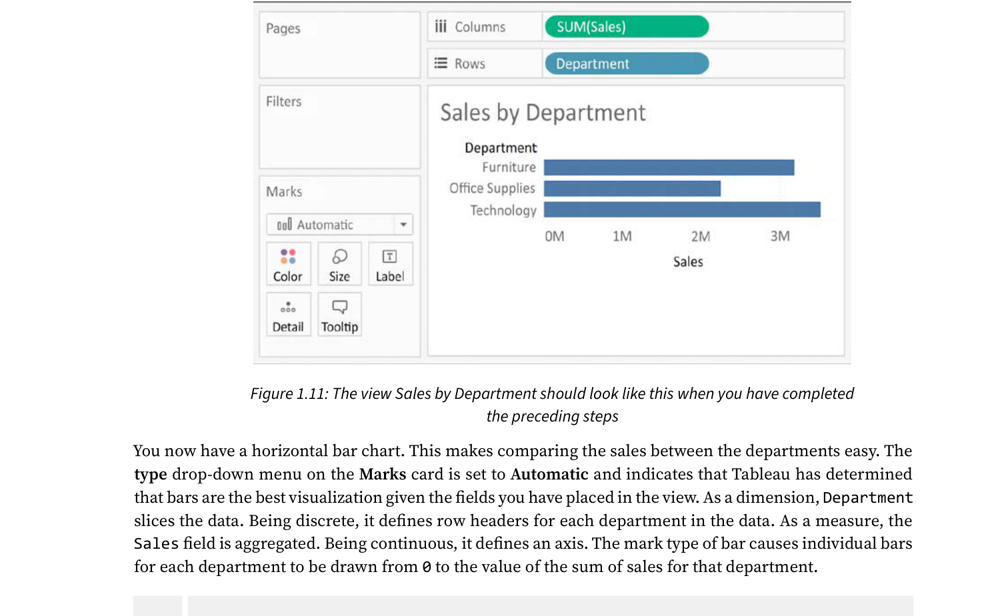
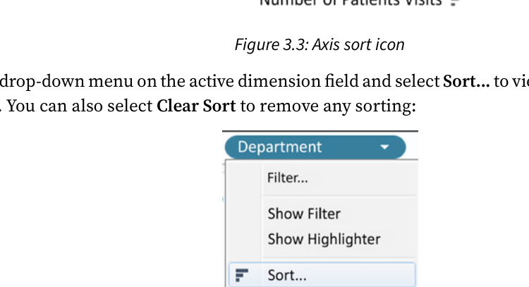
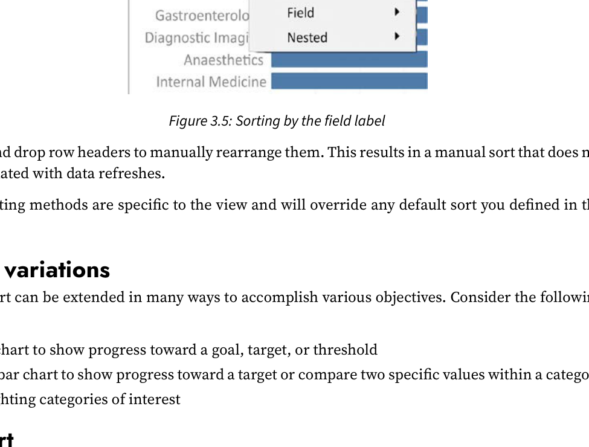
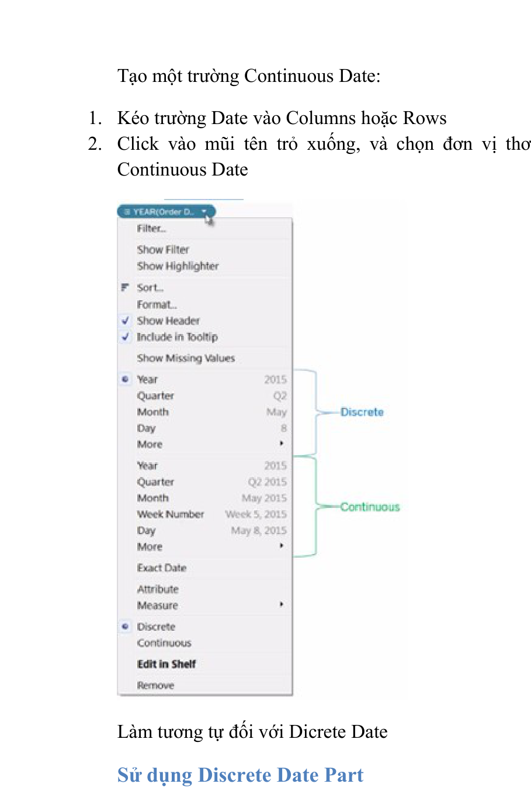
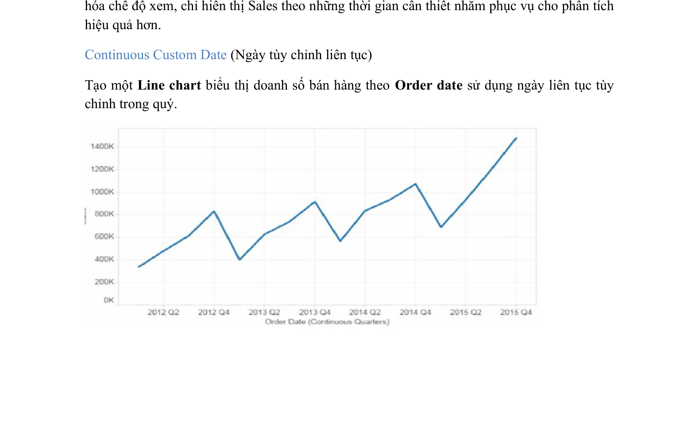
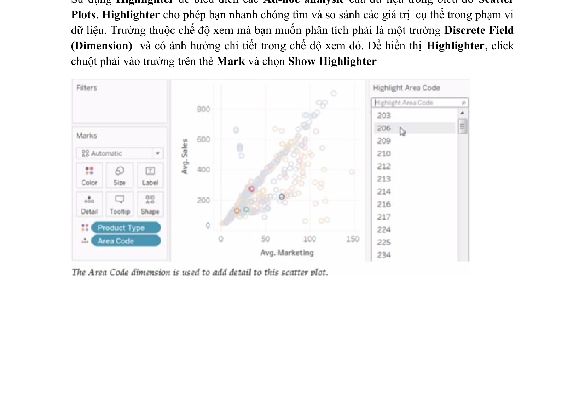

# Các loại biểu đồ cơ bản trong Tableau (Basic Charts)

> **Dataset sử dụng trong ví dụ:** Tableau Superstore — bộ dữ liệu mẫu có sẵn trong Tableau Desktop, tại menu **Help → Sample Workbooks → Superstore**.

---

## I. Giới thiệu — Chọn đúng biểu đồ là nền tảng của data storytelling

Một trong những kỹ năng quan trọng nhất — và cũng thường bị đánh giá thấp nhất — khi làm việc với Tableau là **chọn đúng loại biểu đồ** cho từng câu hỏi phân tích. Biểu đồ không chỉ là vỏ bọc trình bày — nó là phương tiện truyền tải thông điệp. Một biểu đồ được chọn sai có thể khiến xu hướng rõ ràng trở nên vô hình, hoặc tệ hơn, khiến người xem rút ra kết luận sai từ dữ liệu đúng.

Nguyên tắc cốt lõi khi chọn biểu đồ là xuất phát từ **câu hỏi phân tích**, không phải từ dữ liệu có sẵn. Trước khi kéo bất kỳ field nào, hãy tự hỏi: *"Tôi muốn trả lời câu hỏi gì?"* Bảng dưới đây là framework đơn giản nhất để chọn chart:

| Câu hỏi phân tích | Loại biểu đồ phù hợp | Lý do |
|:-----------------|:--------------------|:------|
| Danh mục nào có giá trị lớn nhất/nhỏ nhất? | **Bar Chart** | Chiều dài thanh dễ so sánh |
| Chỉ số thay đổi như thế nào theo thời gian? | **Line Chart** | Đường kết nối thể hiện xu hướng liên tục |
| Khối lượng tích lũy theo thời gian ra sao? | **Area Chart** | Vùng tô màu nhấn mạnh tổng khối lượng |
| Hai chỉ số số có mối tương quan không? | **Scatter Plot** | Vị trí điểm trên mặt phẳng 2D thể hiện quan hệ |
| Dữ liệu phân bố như thế nào? | **Histogram** | Cột tần suất cho thấy phân phối |
| Phân phối khác nhau giữa các nhóm? | **Box Plot** | Trung vị, IQR và outlier trong 1 hình |
| Cần con số chính xác để tra cứu? | **Text Table / Heat Map** | Bảng số liệu không mất thông tin |
| Dữ liệu có yếu tố địa lý? | **Maps** | Bản đồ trực quan hóa vị trí |
| Tỷ lệ phần trong tổng thể? | **Treemap / Packed Bubbles** | Kích thước hình thể hiện tỷ trọng |

> **📌 Khái niệm — Rows/Columns Shelf và Marks Card**
>
> Trong Tableau, toàn bộ quá trình xây dựng biểu đồ xoay quanh việc **kéo và thả (drag & drop)** các field vào đúng vị trí:
> - **Columns shelf**: Xác định những gì hiển thị trên **trục X** (chiều ngang). Thường là Dimension hoặc Date field.
> - **Rows shelf**: Xác định những gì hiển thị trên **trục Y** (chiều dọc). Thường là Measure (số liệu cần đo).
> - **Marks card**: Bộ điều khiển trực quan — gồm các ô **Color**, **Size**, **Label**, **Detail**, **Shape**. Kéo field vào đây để thêm lớp thông tin vào biểu đồ mà không thay đổi cấu trúc chính.

Trong phần tiếp theo, chúng ta sẽ đi qua từng loại biểu đồ theo một trình tự nhất quán: **khi nào dùng** → **cách tạo từng bước** → **các tùy chỉnh nâng cao phổ biến**.

---

## II. Bar Chart — So sánh giữa các danh mục

### Khi nào dùng Bar Chart?

Bar Chart (biểu đồ cột) là loại biểu đồ phổ biến nhất trong phân tích kinh doanh vì lý do đơn giản: **não người rất giỏi so sánh chiều dài**. Khi bạn nhìn vào một Bar Chart, gần như ngay lập tức bạn thấy cột nào cao nhất, cột nào thấp nhất, và các cột cách nhau bao xa. Đây là lợi thế mà Pie Chart hay biểu đồ góc không có được.

Bar Chart phù hợp trong các tình huống sau: so sánh doanh thu, lợi nhuận, hay bất kỳ chỉ số nào giữa các nhóm **rời rạc** (discrete) như danh mục sản phẩm, khu vực, nhân viên, hay sản phẩm riêng lẻ. Điểm mấu chốt là các nhóm này **không có quan hệ thứ tự tự nhiên** — "Furniture" không phải đứng trước hay sau "Technology" về mặt logic. Nếu các nhóm có thứ tự thời gian (tháng 1, tháng 2...), hãy cân nhắc Line Chart.

### Cách tạo Bar Chart trong Tableau

Để minh họa, chúng ta sẽ tạo biểu đồ so sánh tổng doanh thu (`Sales`) theo danh mục sản phẩm (`Category`) trong Superstore.

**Bước 1:** Trong Data Pane, tìm field **`Category`** trong nhóm Dimensions (Dimensions là các field màu xanh dương, chứa dữ liệu văn bản/phân loại). Kéo **`Category`** vào **Columns shelf**.

**Bước 2:** Tìm field **`Sales`** trong nhóm Measures (màu xanh lá, chứa dữ liệu số). Kéo **`Sales`** vào **Rows shelf**.

Ngay lập tức, Tableau tự động tạo một **Vertical Bar Chart** (cột đứng) với 3 cột — Furniture, Office Supplies, Technology — trên trục X, và tổng doanh thu `SUM(Sales)` trên trục Y. Tableau tự động áp dụng hàm `SUM` vì đây là Measure.

*Hình 1: Bar Chart cơ bản trong Tableau — doanh thu theo Department. Chú ý vị trí SUM(Sales) trên Columns shelf và Department trên Rows shelf, cùng Marks card ở bên trái.*

**Bước 3 — Sắp xếp để dễ đọc hơn:** Nhấp vào biểu tượng **Sort Descending** trên toolbar (biểu tượng thanh cột A→Z hoặc Z→A) để sắp xếp từ doanh thu cao đến thấp. Biểu đồ đã sắp xếp luôn dễ đọc hơn — người xem ngay lập tức thấy danh mục nào dẫn đầu mà không cần nhìn từng con số.

**Bước 4 — Thêm màu theo Sub-Category (nâng cao):** Nếu muốn xem thêm phân rã theo danh mục con, kéo **`Sub-Category`** vào ô **Color** trong Marks card. Tableau tự động phân màu các điểm dữ liệu, biến biểu đồ thành **Stacked Bar Chart** — mỗi cột được chia thành nhiều màu ứng với từng Sub-Category. Lúc này mỗi cột đại diện cho tổng doanh thu của một Category, các segment màu bên trong cho biết từng Sub-Category đóng góp bao nhiêu vào tổng đó.

### Biến thể nâng cao — Stacked Bar Chart và Percent of Total

Ngoài Stacked Bar Chart thông thường (giá trị tuyệt đối), một biến thể rất hữu ích là **Stacked Bar Chart 100%** — mỗi cột đều có chiều cao bằng nhau (= 100%) và các segment màu thể hiện **tỷ lệ phần trăm** đóng góp của từng danh mục con. Loại biểu đồ này trả lời câu hỏi *"Cơ cấu nội bộ của mỗi Category như thế nào?"* thay vì *"Category nào bán được nhiều nhất?"*.

Để tạo Stacked Bar 100%, sau khi đã có Stacked Bar Chart thông thường, thực hiện:

**Bước 5:** Nhấp chuột phải vào `SUM(Sales)` trên Rows shelf → chọn **Quick Table Calculation** → chọn **Percent of Total**. Tableau tính lại giá trị, mỗi segment bây giờ hiển thị tỷ lệ phần trăm thay vì giá trị tuyệt đối. Cần chỉ định **Compute Using** → **Cell** để Tableau hiểu tỷ lệ phần trăm được tính trong phạm vi mỗi Category (không phải toàn bộ dataset).

Kết quả: 3 cột với chiều cao bằng nhau, mỗi cột chia nhiều màu thể hiện tỷ trọng % của từng Sub-Category trong từng Category — cực kỳ hữu ích khi so sánh cơ cấu sản phẩm giữa các phân khúc thị trường.

> **💡 Tip — Chuyển sang Horizontal Bar Chart**
>
> Khi tên danh mục quá dài (ví dụ tên sản phẩm đầy đủ), biểu đồ cột đứng sẽ bị chồng chéo nhãn. Giải pháp: nhấp **Ctrl + W** (hoặc vào menu **Analysis → Swap Rows and Columns**) để đổi trục, biến thành Horizontal Bar Chart. Cột ngang thoải mái hơn cho tên dài và giúp mắt đọc từ trái sang phải tự nhiên hơn.

### Sắp xếp (Sort) — 4 phương pháp

Sắp xếp biểu đồ từ cao đến thấp giúp người xem ngay lập tức thấy danh mục nào đứng đầu mà không cần quét qua toàn bộ biểu đồ. Tableau cung cấp 4 phương pháp sắp xếp khác nhau:

**Cách 1 — Toolbar sort button:** Nhấp vào biểu tượng **Sort Ascending/Descending** trên toolbar. Đây là cách nhanh nhất — Tableau tự động sắp xếp Dimension dựa trên Measure đang định nghĩa trục. Khi dữ liệu được cập nhật, thứ tự sắp xếp tự động cập nhật theo.

**Cách 2 — Axis sort icon:** Di chuột lên trục số (trục X hoặc Y) — một biểu tượng sắp xếp nhỏ xuất hiện cạnh tên trục. Nhấp vào đó để bật cột sắp xếp tự động — kết quả giống Cách 1 nhưng kích hoạt từ trục thay vì toolbar.

*Hình 2: Biểu tượng Sort trên trục (Axis sort icon) — xuất hiện khi di chuột lên trục số.*

**Cách 3 — Dropdown Sort menu:** Nhấp vào mũi tên ↓ bên cạnh tên Dimension trên header của biểu đồ (như `Department ⇅`) — một menu drop-down xuất hiện với 4 kiểu sắp xếp:
- **Data source order** — thứ tự trong file gốc
- **Alphabetic** — sắp xếp theo bảng chữ cái
- **Field** — sắp xếp theo Measure cụ thể (bạn chọn Measure nào)
- **Nested** — sắp xếp riêng lẻ trong mỗi Panel (khi biểu đồ có nhiều panel)

*Hình 3: Menu Sort dropdown — hiển thị khi nhấp chuột phải vào Dimension header, cho phép chọn kiểu sắp xếp Field hoặc Nested.*

**Cách 4 — Kéo thủ công (Manual sort):** Giữ và kéo các header trên biểu đồ để sắp xếp thủ công. Kết quả là sắp xếp cố định (fixed) — không tự cập nhật khi dữ liệu thay đổi. Đây là cách duy nhất để định nghĩa thứ tự tùy chỉnh (ví dụ: sắp xếp theo mức ưu tiên kinh doanh, không theo con số).

> **⚠️ Lưu ý:** Mọi phương pháp sắp xếp trên đều **ưu tiên theo view** và ghi đè lên thứ tự mặc định trong metadata. Khi sắp xếp không còn cần, nhấp chuột phải vào field → chọn **Clear Sort** để xóa.

> **📌 Tóm tắt Section II:** Chúng ta đã tạo Bar Chart cơ bản (Hình 1), tìm hiểu Stacked Bar và Percent of Total, và 4 phương pháp sắp xếp (Hình 2, 3).

---

## III. Line Chart — Xu hướng theo thời gian

### Khi nào dùng Line Chart?

Line Chart (biểu đồ đường) là công cụ tối thượng để trả lời câu hỏi: **"Chỉ số này thay đổi như thế nào theo thời gian?"** Đường kẻ nối các điểm dữ liệu liên tiếp tạo ra một "dòng chảy" trực quan, giúp người xem tức thì nhận ra xu hướng tăng, giảm, hay dao động theo mùa. Đây là điều mà Bar Chart không thể làm tốt — nếu trục X là 12 tháng liên tiếp cùng một biến, Bar Chart cho 12 cột rời rạc khó nhận ra xu hướng, trong khi Line Chart cho một đường rõ ràng.

Tuy nhiên, có một nguyên tắc quan trọng cần nhớ: **chỉ dùng Line Chart khi trục X là thời gian hoặc một dãy số có thứ tự liên tục**. Dùng Line Chart cho dữ liệu phân loại rời rạc (như 5 khu vực địa lý) là sai về mặt thống kê học — đường nối giữa "North" và "South" không có ý nghĩa gì.

### Cách tạo Line Chart trong Tableau

Chúng ta sẽ tạo biểu đồ theo dõi xu hướng doanh thu theo từng tháng trong Superstore.

**Bước 1:** Kéo field **`Order Date`** vào **Columns shelf**. Tableau nhận đây là Date field và tự động hiển thị `YEAR(Order Date)` — tổng hợp theo năm. Bạn sẽ thấy trên biểu đồ các điểm dữ liệu rời rạc theo năm, chưa phải Line Chart.

**Bước 2:** Kéo field **`Sales`** vào **Rows shelf**. Lúc này Tableau đã có đủ thông tin: trục X là Date và trục Y là Measure số, nên tự động chuyển sang **Line Chart**.

**Bước 3 — Drill down từ Năm xuống Tháng:** Hiện tại biểu đồ chỉ hiển thị theo năm — quá thô để thấy xu hướng mùa vụ. Để xem chi tiết hơn, nhấp chuột phải vào `YEAR(Order Date)` đang hiển thị trên Columns shelf. Trong menu hiện ra, bạn thấy **2 nhóm tùy chọn** (tách biệt bởi đường kẻ ngang):
   - Nhóm **trên** (xanh dương — Discrete): trả về nhãn dạng header rời rạc
   - Nhóm **dưới** (xanh lá — Continuous): trả về trục liên tục theo thời gian

   Chọn **`Month`** trong nhóm **dưới** (Continuous). Biểu đồ sẽ chuyển từ hiển thị theo năm sang theo từng tháng với trục thời gian liên tục, đường kẻ trở nên chi tiết và mượt hơn.

*Hình 4: Menu Date pill — Nhóm trên (Discrete, xanh dương) tạo header riêng cho mỗi giá trị, nhóm dưới (Continuous, xanh lá) tạo trục thời gian liên tục.*

**Bước 4 — Thêm nhiều đường để so sánh:** Kéo **`Category`** vào ô **Color** trong Marks card. Tableau sẽ vẽ **3 đường riêng biệt** — một đường cho mỗi Category, phân biệt bằng màu sắc. Bây giờ chúng ta có thể so sánh xu hướng doanh thu của Furniture vs Office Supplies vs Technology theo cùng trục thời gian.

> **💡 Tip — Discrete Date vs Continuous Date: khác nhau quan trọng**
>
> Khi nhấp chuột phải vào một Date field trên shelf, Tableau luôn hiển thị 2 nhóm lựa chọn:
> - **Discrete (màu xanh dương):** Mỗi giá trị thời gian trở thành một **header riêng biệt**. Ví dụ "January", "February"... hoặc "2021", "2022"... — hữu ích khi muốn tạo cột riêng theo năm trong bảng.
> - **Continuous (màu xanh lá):** Thời gian được hiểu là một **trục liên tục** — đường kẻ chạy mượt, tỷ lệ giữa các điểm thời gian được bảo toàn chính xác.
>
> **Quy tắc:** Với Line Chart, **luôn** chọn Continuous để trục X phản ánh đúng dòng chảy thời gian. Dùng Discrete chỉ khi muốn tạo các cột tiêu đề tách biệt (như trong Text Table theo năm).

*Hình 5: Line Chart với trục X là Continuous Date (theo quý). Đường kẻ nối liền mạch từ 2012 Q2 đến 2015 Q4, cho thấy xu hướng doanh thu tăng rõ rệt.*

### Discrete vs Continuous Date — Hiểu sâu để tạo biểu đồ đúng

Đây là một trong những concept quan trọng nhất khi làm việc với dữ liệu thời gian trong Tableau, và cũng là nguồn gốc của rất nhiều lỗi biểu đồ khó hiểu: **tại sao đường kẻ bị đứt khi qua năm mới?**

| Discrete Date (màu xanh dương 🔵) | Continuous Date (màu xanh lá 🟢) |
|:----------------------------------|:----------------------------------|
| Mỗi giá trị = một **header riêng biệt** | Toàn bộ = một **trục số liên tục** |
| `YEAR(Date)` Discrete: `2022 | 2023 | 2024` riêng biệt | `YEAR(Date)` Continuous: trục 2022→2024 liền mạch |
| Pill **màu xanh dương** trên shelf | Pill **màu xanh lá** trên shelf |
| `MONTH(Date)` Discrete: Jan→Dec cho mỗi năm | `MONTH(Date)` Continuous: nghĩa là DATE value bị truncate theo tháng |
| Đường **không nối qua** giữa các năm | Đường **nối liền** xuyên suốt các năm |

**Ví dụ minh họa — Tại sao đường bị đứt:**

Nếu bạn kéo `Order Date` vào Columns shelf và chọn `Month` (Discrete, màu xanh dương), Tableau tạo ra 12 header **January, February, ..., December** — mỗi năm tạo **một bộ 12 header riêng** và đường không nối qua giữa năm. Đây là Discrete — nó hỏi "tháng 1 năm nào?" chứ không biết thứ tự giữa các năm.

Nếu chọn `MONTH(Date)` Continuous (màu xanh lá), Tableau tạo một **trục Date liên tục** từ January 2021 → December 2024 liền mạch, đường kẻ nối thông suốt qua các năm.

**Cách chuyển đổi:**
Nhấp chuột phải vào Date pill đang hiển thị trên shelf → menu xuất hiện với **2 nhóm tùy chọn** (nhóm trên = Discrete xanh dương, nhóm dưới = Continuous xanh lá):
- Chọn cùng cấp độ (Year/Quarter/Month) ở nhóm Continuous để chuyển từ Discrete sang Continuous
- Hoặc nhấp chuột phải vào pill → chọn “Discrete” / “Continuous” trực tiếp

> **✅ Quy tắc đơn giản:**
> - Dùng Line Chart để xem xu hướng theo thời gian → luôn chọn **Continuous date**
> - Dùng Discrete date khi cần tạo header riêng biệt (như trong Text Table theo năm-tháng)
> - Nếu đường bị đứt, kiểm tra ngay: pill Date có màu xanh dương không? Nếu có, hãy chuyển sang Continuous.

---

## IV. Area Chart — Nhấn mạnh khối lượng tích lũy theo thời gian

### Khi nào dùng Area Chart?

Area Chart thực chất là **Line Chart với vùng dưới đường được tô màu**. Sự khác biệt tuy đơn giản nhưng mang ý nghĩa truyền thông quan trọng: Line Chart nhấn mạnh **xu hướng** (lên hay xuống), còn Area Chart nhấn mạnh **khối lượng tích lũy** (tổng giá trị qua thời gian). Hãy tưởng tượng Line Chart như đường chân trời — bạn thấy hướng đi nhưng không thấy "lượng" bên dưới. Area Chart lấp đầy phần đó.

Dùng Area Chart khi:
- Muốn thể hiện **phần đóng góp của từng nhóm** trong tổng giá trị theo thời gian (Stacked Area)
- Muốn nhấn mạnh **khối lượng tổng cộng** chứ không chỉ đường xu hướng
- Có 2–4 nhóm cần so sánh — quá nhiều nhóm sẽ khiến biểu đồ trở nên rối và khó đọc

### Cách tạo Area Chart trong Tableau

**Bước 1:** Kéo **`Order Date`** vào **Columns shelf**. Nhấp chuột phải → chọn **Month** (Continuous) trong nhóm dưới để có trục thời gian liên tục.

**Bước 2:** Kéo **`Sales`** vào **Rows shelf**. Tableau tạo Line Chart mặc định.

**Bước 3 — Chuyển sang Area Chart:** Trong **Marks card**, nhấp vào dropdown **Mark Type** (đang hiển thị "Automatic" hoặc "Line") → chọn **Area**. Vùng dưới đường kẻ lập tức được tô màu — biểu đồ bây giờ nhấn mạnh tổng khối lượng bán hàng tích lũy.

**Bước 4 — Tạo Stacked Area Chart:** Kéo **`Category`** vào ô **Color** trong Marks card. Tableau tạo 3 vùng màu xếp chồng (stacked) — Furniture, Office Supplies, Technology. Mỗi vùng thể hiện phần đóng góp của Category đó vào tổng doanh thu. Vùng phía trên cùng chính là tổng doanh thu toàn công ty.

> **💡 Tip — Area Chart vs Line Chart: khi nào chọn cái nào?**
>
> | Tiêu chí | Line Chart | Area Chart |
> |:---------|:-----------|:-----------|
> | Mục đích chính | Xu hướng | Khối lượng / tỷ trọng |
> | Nhiều nhóm | Dễ đọc (đường tách biệt) | Khó đọc nếu > 4 nhóm (vùng chồng lấp) |
> | Giá trị âm | Hiển thị tốt | Khó diễn giải khi tô màu vùng âm |
> | Stacked | Không hỗ trợ | Mạnh — thể hiện phần đóng góp |
>
> **Quy tắc nhanh:** Nếu chỉ cần xem xu hướng → Line. Nếu muốn thấy "miếng bánh" thay đổi theo thời gian → Stacked Area.

> **⚠️ Cạm bẫy — Stacked Area có thể gây hiểu lầm**
>
> Trong Stacked Area, vùng trên cùng bị "đẩy lên" bởi các vùng bên dưới. Điều này có nghĩa **đường biên trên của một vùng KHÔNG phải là giá trị thực** của nhóm đó — nó là tổng tích lũy. Nếu người đọc không hiểu điều này, họ sẽ đánh giá sai kích thước vùng trên cùng. Giải pháp: dùng **Percent of Total Stacked Area** (nhấp chuột phải vào `SUM(Sales)` → Quick Table Calculation → Percent of Total) khi muốn so sánh tỷ trọng thay vì giá trị tuyệt đối.

---

## V. Scatter Plot — Khám phá tương quan giữa hai chỉ số

### Khi nào dùng Scatter Plot?

Scatter Plot (biểu đồ phân tán) là công cụ lý tưởng để trả lời câu hỏi: **"Hai chỉ số này có liên quan với nhau không?"** Mỗi điểm trên Scatter Plot đại diện cho một đơn thể (sản phẩm, khách hàng, đơn hàng...) với vị trí trên trục X xác định bởi chỉ số thứ nhất và trục Y bởi chỉ số thứ hai. Nếu các điểm tập trung theo một đường chéo từ dưới-trái lên trên-phải, hai chỉ số có **tương quan thuận** (cái này tăng thì cái kia cũng tăng). Nếu ngược lại, chúng có **tương quan nghịch**.

Trong ngữ cảnh Superstore, Scatter Plot giúp trả lời những câu hỏi kinh doanh quan trọng: Các sản phẩm bán nhiều (`Sales` cao) có mang lại lợi nhuận cao (`Profit` cao) không? Hay có những sản phẩm "bán chạy nhưng lỗ" mà ta cần loại bỏ? Ngoài ra, Scatter Plot cũng giỏi phát hiện **outliers** — những điểm nằm xa đám mây điểm chính, có thể là cơ hội hoặc vấn đề cần điều tra.

### Cách tạo Scatter Plot trong Tableau

**Bước 1:** Kéo **`Sales`** (Measure) vào **Columns shelf** — đây sẽ là trục X.

**Bước 2:** Kéo **`Profit`** (Measure) vào **Rows shelf** — đây sẽ là trục Y.

Ngay lúc này, Tableau hiển thị **chỉ 1 điểm duy nhất** ở giữa canvas. Đừng bối rối — đây không phải lỗi. Tableau đang hiển thị `SUM(Sales)` và `SUM(Profit)` của **toàn bộ dataset** gộp lại thành một con số tổng, nên chỉ có 1 điểm. Biểu đồ này chưa có ý nghĩa phân tích.

**Bước 3 — Bước quan trọng nhất:** Kéo **`Sub-Category`** vào ô **Detail** trong Marks card. Tableau hiểu rằng bây giờ chúng ta muốn nhìn từng **Sub-Category riêng** thay vì tổng hợp tất cả. Ngay lập tức, 1 điểm biến thành **17 điểm** — mỗi điểm là một Sub-Category với tọa độ `(SUM(Sales), SUM(Profit))` của riêng nó.

**Bước 4 — Thêm màu và kích thước:** Kéo **`Category`** vào **Color** để phân biệt 3 nhóm lớn bằng màu. Kéo **`Quantity`** vào **Size** để kích thước điểm phản ánh số lượng bán ra — điểm to = bán nhiều đơn. Lúc này mỗi điểm mang 4 chiều thông tin: Sales (trục X), Profit (trục Y), Category (màu), Quantity (kích thước).

**Bước 5 — Thêm tứ phân vị (nâng cao):** Vào menu **Analysis → Add Reference Line**. Chọn **Average** cho trục X và tương tự cho trục Y. Hai đường trung bình tạo thành 4 góc phần tư (quadrant) giúp phân loại các Sub-Category:
  - Góc trên-phải: Sales cao + Profit cao → **"Stars"** (giữ và đầu tư)
  - Góc dưới-phải: Sales cao + Profit thấp → **"Cash Cows"** (bán nhiều nhưng lãi ít — cần xem xét giá)
  - Góc trên-trái: Sales thấp + Profit cao → **"Niche"** (lãi tốt nhưng ít bán — tìm cách mở rộng)
  - Góc dưới-trái: Sales thấp + Profit thấp → **"Question Marks"** (cân nhắc loại bỏ)

### Đọc hiểu kết quả — 3 loại tương quan và Outliers

Khi phân tích Scatter Plot, kỹ năng quan trọng nhất là nhận ra **kiểu phân bố của đám mây điểm** và từ đó suy ra mối quan hệ giữa hai biến. Tài liệu học thuật phân loại tương quan thành 3 nhóm chính, mỗi nhóm có ý nghĩa kinh doanh khác nhau:

| Loại tương quan | Mô tả đám mây điểm | Ý nghĩa |
|:---------------|:--------------------|:---------|
| **Positive (Tương quan thuận)** | Điểm phân bố từ dưới-trái lên trên-phải | Một biến tăng → biến kia cũng tăng. VD: Sales tăng đi cùng Profit tăng |
| **Negative (Tương quan nghịch)** | Điểm phân bố từ trên-trái xuống dưới-phải | Một biến tăng → biến kia giảm. VD: Discount cao đi cùng Profit thấp |
| **No relation (Không tương quan)** | Điểm rải đều không theo hướng nào | Hai biến độc lập nhau |

Ngoài ba nhóm trên, cần chú ý đặc biệt đến **Outliers** — những điểm nằm cô lập xa đám mây điểm chính. Trong Superstore, một Sub-Category có Profit âm lớn trong khi phần còn lại đều dương chính là outlier — đây là tín hiệu cần điều tra: giá bán quá thấp? Chi phí vận chuyển quá cao? Chính sách chiết khấu không phù hợp?

Tableau cung cấp 2 cách xử lý Outliers trực tiếp trên biểu đồ:
- **Annotate (Chú thích):** Nhấp chuột phải vào điểm outlier → **Annotate → Mark** → nhập mô tả. Chú thích này xuất hiện ngay trên biểu đồ, hữu ích khi trình bày để đánh dấu Sub-Category cần chú ý.
- **Exclude (Loại trừ tạm thời):** Nhấp chuột phải vào điểm outlier → **Exclude**. Điểm bị ẩn khỏi view để phần còn lại hiển thị với scale phù hợp hơn. Lưu ý đây chỉ là ẩn hiển thị — dữ liệu gốc không bị xóa và Tableau sẽ thông báo rõ "1 member is excluded".

### Công cụ phân tích nâng cao — Highlighter

Khi Scatter Plot có nhiều điểm dữ liệu (hàng chục Sub-Category hoặc hàng trăm sản phẩm), rất khó nhìn ra một điểm cụ thể giữa đám mây. **Highlighter** là giải pháp: nó cho phép gõ tên để tô sáng tức thì các điểm liên quan trong khi làm mờ phần còn lại, giúp so sánh ad-hoc một cách trực quan.

Cách bật Highlighter: Nhấp chuột phải vào một Dimension field trong Marks card → chọn **Show Highlighter**. Một ô tìm kiếm nhỏ xuất hiện góc trên bên phải của biểu đồ. Khi bạn gõ, các điểm khớp với tìm kiếm sẽ được tô sáng ngay lập tức — ví dụ gõ "Chairs" sẽ làm nổi bật toàn bộ điểm thuộc Sub-Category Chairs trong tất cả các chart trên dashboard.

> **⚠️ Lưu ý — Tại sao Scatter Plot chỉ hiện 1 điểm?**
>
> Đây là điểm gây nhầm lẫn phổ biến nhất với Scatter Plot trong Tableau. Khi bạn đặt 2 Measure vào Rows và Columns mà **không có bất kỳ Dimension nào trong Detail, Color, hay Shape**, Tableau tổng hợp (aggregate) tất cả dữ liệu thành **một cụm điểm duy nhất** — tổng Sales và tổng Profit của toàn bộ dataset.
>
> **Giải pháp:** Kéo **ít nhất 1 Dimension** vào ô **Detail** hoặc **Color** trong Marks card. Dimension này sẽ "phá vỡ" sự tổng hợp và tạo ra một điểm riêng cho mỗi giá trị của Dimension đó. Quy tắc này áp dụng cho mọi biểu đồ sử dụng 2 Measure trên 2 trục.

*Hình 6: Scatter Plot với Highlighter panel. Mỗi điểm đại diện cho một Area Code, màu phân biệt theo Product Type. Dimension "Area Code" được kéo vào Detail trong Marks card để tạo nhiều điểm thay vì 1 điểm tổng hợp.*

---

## VI. Histogram — Xem phân phối của dữ liệu

### Khi nào dùng Histogram?

Histogram trả lời câu hỏi: *"Dữ liệu phân bố như thế nào?"* — đa số đơn hàng rơi vào khoảng giá nào? Có bao nhiêu kích thước đơn hàng rất lớn so với trung bình? **Histogram trông giống Bar Chart nhưng khác biệt cơ bản**: Bar Chart so sánh giữa các **danh mục rời rạc** (Furniture vs Technology), còn Histogram chia một **biến liên tục** thành các khoảng (bins) và đếm số lượng rơi vào từng khoảng.

Dùng Histogram khi:
- Muốn hiểu hình dạng phân phối của dữ liệu (chuông, lệch phải, đa đỉnh...)
- Muốn nhận ra **outlier** (giá trị bất thường) một cách trực quan
- Muốn biết **đa số** dữ liệu rơi vào khoảng nào (VD: đa số đơn hàng Superstore có giá $0–$500)

### Cách tạo Histogram trong Tableau

**Cách 1 — Dùng Show Me (nhanh nhất):**

1. Trong Data Pane, nhấp chọn field **`Sales`** (hoặc bất kỳ Measure nào muốn xem phân phối).
2. Nhấp **Show Me** (góc trên bên phải) → chọn biểu tượng **Histogram** (hình các cột liền kề nhau). Tableau tự động tạo **Bin** và hiển thị Histogram hoàn chỉnh.

**Cách 2 — Tạo thủ công (kiểm soát bin size):**

1. Trong Data Pane, nhấp chuột phải vào **`Sales`** → **Create → Bins...**
2. Tableau gợi ý **Bin Size** tự động (dựa trên range của dữ liệu). Bạn có thể chỉnh — ví dụ: đặt Bin Size = **200** nghĩa là mỗi cột đại diện cho khoảng $200 (0–200, 200–400, 400–600...). Nhấp **OK**.
3. Trong Data Pane xuất hiện field mới **`Sales (bin)`** (icon giống Dimension kèm ký hiệu bin). Kéo **`Sales (bin)`** vào **Columns shelf**.
4. Kéo **`Sales`** vào **Rows shelf** → nhấp chuột phải → chọn **Measure (Count)** hoặc **CNT(Sales)**. Lúc này Histogram hoàn chỉnh: trục X là khoảng giá, trục Y là số lượng đơn hàng.

> **💡 Tip — Chọn Bin Size phù hợp**
>
> Bin Size quá nhỏ → biểu đồ rối, khó thấy pattern. Bin Size quá lớn → mất chi tiết, mọi thứ dồn vào 2–3 cột. Quy tắc thực tế: bắt đầu với Bin Size mặc định của Tableau, sau đó thử tăng/giảm để tìm mức hiển thị rõ nhất hình dạng phân phối. Để chỉnh lại: nhấp chuột phải vào **`Sales (bin)`** trong Data Pane → **Edit...**

> **⚠️ Khác biệt Bar Chart vs Histogram**
>
> |  | Bar Chart | Histogram |
> |:--|:----------|:----------|
> | Trục X | Danh mục rời rạc (Category) | Khoảng liên tục (Bins) |
> | Khoảng cách cột | Có gap giữa các cột | Không có gap (liền kề) |
> | Ý nghĩa | So sánh giá trị giữa nhóm | Phân phối / tần suất |

---

## VII. Box Plot (Box & Whisker) — So sánh phân phối giữa các nhóm

### Khi nào dùng Box Plot?

Box Plot (đôi khi gọi là Box & Whisker) là công cụ thống kê chuyên dụng để **so sánh phân phối của một Measure giữa nhiều nhóm** — ví dụ: mức Discount trung bình và độ biến động giữa các Region khác nhau như thế nào? Box Plot nén 5 thông tin thống kê vào 1 hình: **trung vị (median)**, **tứ phân vị 1 và 3 (Q1, Q3)**, **râu (whiskers)**, và **outlier**.

Dùng Box Plot khi:
- Muốn so sánh **độ phân tán** của dữ liệu giữa nhiều nhóm (VD: Profit distribution theo Category)
- Muốn nhận ra **outlier** (giá trị nằm ngoài râu) — các điểm bất thường cần điều tra
- Muốn biết **giá trị điển hình** (median) và **độ biến động** (IQR = Q3 – Q1) của mỗi nhóm

### Cách tạo Box Plot trong Tableau

**Bước 1:** Kéo **`Region`** (Dimension) vào **Columns shelf** — tạo các nhóm để so sánh.

**Bước 2:** Kéo **`Discount`** (Measure) vào **Rows shelf**. Tableau mặc định tạo Bar Chart với `SUM(Discount)` — chưa đúng.

**Bước 3 — Tăng độ chi tiết:** Kéo **`Sub-Category`** (hoặc bất kỳ Dimension nào có nhiều giá trị) vào ô **Detail** trong Marks card. Điều này "phá vỡ" sự tổng hợp — mỗi Sub-Category trở thành một điểm dữ liệu riêng.

**Bước 4 — Chuyển sang Box Plot:** Nhấp **Show Me** → chọn **Box-and-Whisker Plot**. Tableau tự động tính toán median, Q1/Q3, và vẽ râu + outlier.

### Đọc hiểu Box Plot

| Thành phần | Ý nghĩa |
|:-----------|:--------|
| **Đường nằm ngang trong hộp** | **Median** — giá trị trung vị (50% dữ liệu trên, 50% dưới) |
| **Cạnh dưới hộp** | **Q1** (Quartile 1) — 25% dữ liệu nằm dưới mức này |
| **Cạnh trên hộp** | **Q3** (Quartile 3) — 75% dữ liệu nằm dưới mức này |
| **Chiều cao hộp (IQR)** | **Q3 – Q1** — càng cao = dữ liệu càng phân tán |
| **Râu (whiskers)** | Mở rộng đến giá trị xa nhất trong khoảng 1.5 × IQR |
| **Điểm riêng lẻ (outlier)** | Giá trị nằm ngoài râu — **bất thường**, cần điều tra |

> **💡 Tip — Tùy chỉnh hiển thị outlier**
>
> Mặc định Tableau hiển thị outlier như các điểm tròn nhỏ. Để tùy chỉnh: nhấp chuột phải vào trục Y → **Edit Reference Line** → thay đổi **Whisker** và **Outlier** style. Bạn có thể ẩn outlier hoặc đổi màu để nhấn mạnh.

---

## VIII. Text Table, Heat Map & Highlight Table — Bảng số liệu và màu sắc

### Khi nào dùng Text Table?

Text Table (còn được gọi là Crosstab — bảng chéo, hay Pivot Table) là biểu đồ theo nghĩa rộng nhất: nó không vẽ hình, mà hiển thị **con số cụ thể trong từng ô giao nhau** của hàng và cột. Đây là lựa chọn phù hợp khi người đọc cần **tra cứu hoặc so sánh giá trị chính xác** — "Doanh thu của Furniture trong năm 2023 là bao nhiêu đúng?" là câu hỏi mà Bar Chart hay Line Chart không trả lời được trực tiếp, nhưng Text Table thì có.

Tuy nhiên, Text Table cũng có nhược điểm đáng kể: rất khó nhận ra xu hướng, khó so sánh giữa nhiều con số cùng lúc, và trở nên khó đọc khi có nhiều hàng/cột. Một quy tắc thực tế: **chỉ dùng Text Table khi người xem thực sự cần con số chính xác** — ví dụ báo cáo tài chính, bảng KPI hàng tháng, hay khi người đọc là kế toán cần đối chiếu số liệu. Với hầu hết mục đích trình bày và phân tích xu hướng, các loại biểu đồ trực quan (Bar, Line, Area, Scatter...) sẽ hiệu quả hơn.

### Cách tạo Text Table trong Tableau

Chúng ta sẽ tạo bảng thể hiện doanh thu (`Sales`) phân theo `Category` (hàng) và năm (cột).

**Bước 1:** Kéo **`Category`** vào **Rows shelf**. Tableau tạo 3 hàng — Furniture, Office Supplies, Technology.

**Bước 2:** Kéo **`Order Date`** vào **Columns shelf**. Tableau mặc định tổng hợp theo `YEAR(Order Date)`, tạo ra các cột theo từng năm trong dataset.

**Bước 3:** Kéo **`Sales`** vào ô **Text** trong Marks card (không phải Rows/Columns). Tableau điền giá trị `SUM(Sales)` vào từng ô giao nhau của lưới — mỗi ô là tổng doanh thu của một Category trong một năm cụ thể.

**Bước 4 — Định dạng số để dễ đọc:** Con số mặc định Tableau hiển thị dạng thô `"1234567.89"` — khó đọc. Để định dạng, nhấp chuột phải vào `SUM(Sales)` trong Marks card, chọn **Format...**. Trong panel Format bên trái, chọn **Numbers → Currency (Custom)** → bật **"Include thousands separators"**. Lúc này số hiển thị dạng `"$1,234,567.89"` — sạch và dễ đọc hơn nhiều.

**Bước 5 — Nâng cấp thành Highlight Table:** Một biến thể mạnh mẽ hơn của Text Table là **Highlight Table** — giữ nguyên con số nhưng **thêm màu nền** gradient từ nhạt (giá trị thấp) đến đậm (giá trị cao), giúp mắt ngay lập tức nhận ra ô nào có giá trị cao/thấp mà không cần đọc từng con số. Để tạo Highlight Table: kéo thêm `Sales` vào ô **Color** trong Marks card (bên cạnh `Sales` đã có ở Text), sau đó chuyển Mark type từ **Automatic** sang **Square** trong dropdown đầu Marks card.

### Heat Map — Không cần số, chỉ cần màu

**Heat Map** là biến thể cực đoan hơn của Highlight Table: **bỏ hết con số, chỉ giữ màu sắc**. Mỗi ô trong lưới được tô màu từ nhạt đến đậm dựa trên giá trị của Measure. Dùng khi:
- Có lưới lớn (nhiều hàng × nhiều cột) — số quá nhiều sẽ rối, màu giúp quay nhanh
- Muốn nhận ra **pattern** trong dữ liệu (vùng nóng / vùng lạnh)
- Muốn trình bày cho đối tượng không quen đọc số

Cách tạo: giống Highlight Table nhưng **không kéo Measure vào Text** — chỉ kéo vào **Color** và **Size** (nếu muốn ô lớn/nhỏ theo giá trị). Mark type = **Square** hoặc **Circle**.

> **💡 Tip — Thêm Grand Total vào bảng**
>
> Để thêm hàng tổng và cột tổng vào Text Table (tương tự "Total row" trong Excel): vào menu **Analysis → Totals → Show Row Grand Totals** và **Show Column Grand Totals**. Tableau tự động tính `SUM` cho toàn bộ hàng và cột, thêm vào dưới cùng và bên phải của bảng. Rất hữu ích khi cần kiểm tra tổng doanh thu toàn công ty so với từng phân khúc.

*Hình 7: Hướng dẫn tạo Text Table — kéo field dữ liệu vào đúng vị trí để tạo bảng chéo (crosstab). State vào Rows, Total amount of grants vào giữa view.*

---

## IX. Maps — Trực quan hóa dữ liệu địa lý

### Khi nào dùng Maps?

Khi dữ liệu chứa **thông tin địa lý** (Country, State, City, Postal Code), bản đồ là cách trực quan nhất để trả lời câu hỏi: *"Khu vực nào có doanh thu cao nhất? Vùng nào có nhiều khách hàng?"* Tableau tự nhận diện các field địa lý (qua icon 🌐 trong Data Pane) và tự động tạo bản đồ khi bạn sử dụng chúng.

Tableau hỗ trợ **2 loại bản đồ chính**:

| Loại | Mô tả | Khi nào dùng |
|:-----|:-------|:----------|
| **Symbol Map** | Mỗi vị trí được đánh dấu bằng **điểm tròn** — kích thước và màu thay đổi theo Measure | Dữ liệu theo điểm (thành phố, cửa hàng, khách hàng) |
| **Filled Map** | Tô màu toàn bộ **vùng** (quốc gia, bang) theo giá trị Measure | So sánh vùng/khu vực, choropleth map |

### Cách tạo Symbol Map

**Bước 1:** Double-click vào field **`State`** (hoặc bất kỳ Geographic field) trong Data Pane. Tableau tự động tạo bản đồ với các điểm đánh dấu trên từng State. Phía sau, Tableau sử dụng **Latitude (generated)** và **Longitude (generated)** để định vị.

**Bước 2:** Kéo **`Sales`** vào ô **Size** trong Marks card. Giờ các điểm có kích thước khác nhau — điểm lớn = doanh thu cao.

**Bước 3:** Kéo **`Profit`** vào ô **Color** trong Marks card. Các điểm được tô màu từ đỏ (âm / lỗ) đến xanh (dương / lãi). Lúc này bản đồ cho thấy cả **quy mô** (kích thước) và **hiệu suất** (màu) của từng State.

### Cách tạo Filled Map

**Bước 1:** Double-click vào field **`State`** để tạo bản đồ cơ bản.

**Bước 2:** Trong **Marks card**, chuyển dropdown **Mark Type** từ **Automatic** sang **Filled Map** (hoặc **Map**). Toàn bộ vùng của mỗi State được tô màu.

**Bước 3:** Kéo **`Sales`** vào **Color**. Các State có doanh thu cao sẽ có màu đậm hơn.

> **⚠️ Xử lý vị trí không nhận được**
>
> Đôi khi Tableau không nhận ra một số địa danh — góc dưới bên phải xuất hiện thông báo **"X unknown"**. Nhấp vào đó → **Edit Locations** → chỉnh sửa bằng tay (gán đúng tên quốc gia, bang). Với dataset Superstore (có field Country, State, City), Tableau nhận diện gần như 100% chính xác.

> **💡 Tip — Symbol Map vs Filled Map: khi nào dùng cái nào?**
>
> | Tiêu chí | Symbol Map | Filled Map |
> |:---------|:-----------|:-----------|
> | Phù hợp | Dữ liệu theo điểm (cửa hàng, khách hàng) | Dữ liệu theo vùng (quốc gia, bang) |
> | Hiển thị nhiều Measure | Kích thước + Màu = 2 Measure | Chỉ Màu = 1 Measure |
> | Vùng nhỏ | Vẫn thấy rõ (điểm tròn) | Dễ bị lấp bởi vùng lớn |

---

## X. Treemap & Packed Bubbles — Tỷ lệ phần trong tổng thể

### Khi nào dùng Treemap / Packed Bubbles?

Treemap và Packed Bubbles đều trả lời câu hỏi: *"Phần nào chiếm tỷ trọng lớn nhất trong tổng thể?"* Thay vì dùng chiều dài thanh (Bar Chart), chúng dùng **kích thước hình** để thể hiện tỷ lệ — hình lớn = giá trị lớn.

| Loại | Hình dạng | Đặc điểm |
|:-----|:-----------|:-----------|
| **Treemap** | Hình chữ nhật lồng nhau | Sử dụng không gian hiệu quả, hỗ trợ phân cấp (Category → Sub-Category) |
| **Packed Bubbles** | Hình tròn xếp sát nhau | Trực quan, dễ nhìn, phù hợp trình bày nhưng kém chính xác khi so sánh |

### Cách tạo Treemap

**Bước 1:** Kéo **`Sub-Category`** vào ô **Detail** (hoặc **Label**) trong Marks card. Mỗi Sub-Category sẽ trở thành một hình chữ nhật.

**Bước 2:** Kéo **`Sales`** vào ô **Size** trong Marks card. Kích thước mỗi ô tỷ lệ với doanh thu — ô lớn nhất là Sub-Category có doanh thu cao nhất.

**Bước 3:** Kéo **`Category`** vào ô **Color** trong Marks card. Mỗi Category được gán một màu riêng, giúp phân biệt nhóm. Nếu chưa tự động hiển thị Treemap, chuyển **Mark Type** sang **Square** hoặc dùng **Show Me → Treemap**.

**Bước 4 (tùy chọn):** Kéo **`Sales`** vào **Label** để hiển thị giá trị trên mỗi ô.

### Cách tạo Packed Bubbles

Tương tự Treemap nhưng thay **Mark Type = Circle**:

1. Kéo **`Sub-Category`** vào **Detail** — mỗi giá trị thành một bọt.
2. Kéo **`Sales`** vào **Size** — bọt lớn = doanh thu cao.
3. Kéo **`Category`** vào **Color** — phân màu theo nhóm.
4. Chuyển **Mark Type** sang **Circle** (hoặc dùng **Show Me → Packed Bubbles**).
5. (Tùy chọn) Kéo **`Sub-Category`** vào **Label** để hiển thị tên trên mỗi bọt.

> **💡 Tip — Treemap vs Bar Chart: khi nào chọn Treemap?**
>
> Bar Chart vẫn **chính xác hơn** khi so sánh giá trị (mắt người đánh giá chiều dài tốt hơn diện tích). Treemap nổi bật khi:
> - Dữ liệu có **phân cấp** (Category → Sub-Category → Product) — Treemap thể hiện tự nhiên bằng ô lồng nhau
> - Có **rất nhiều danh mục** (20–50+) — Bar Chart với 50 cột sẽ rất dài, Treemap gọn gàng hơn
> - Muốn nhấn mạnh **tỷ trọng** hơn là giá trị tuyệt đối

---

## XI. Tổng kết — Chọn chart phù hợp trong 10 giây

Sau khi đã quen với cả 10 loại biểu đồ, chúng ta có thể rút gọn quy trình chọn chart thành một flow đơn giản: nhìn vào **kiểu dữ liệu** và **mục đích phân tích** để quyết định ngay.

| Loại biểu đồ | Câu hỏi trả lời | Trục X cần gì | Trục Y cần gì |
|:-------------|:----------------|:--------------|:--------------|
| **Bar Chart** | Cái nào lớn hơn/nhỏ hơn? | Dimension | Measure |
| **Line Chart** | Xu hướng thay đổi thế nào? | Date (liên tục) | Measure |
| **Area Chart** | Khối lượng + tỷ trọng theo thời gian? | Date (liên tục) | Measure |
| **Scatter Plot** | Hai chỉ số liên quan thế nào? | Measure | Measure |
| **Histogram** | Dữ liệu phân bố như thế nào? | Bins (liên tục) | Count |
| **Box Plot** | Phân phối khác nhau giữa các nhóm? | Dimension | Measure (disagg.) |
| **Text Table / Heat Map** | Con số chính xác? Pattern trong lưới? | Dimension | Dimension |
| **Maps** | Vùng nào nổi bật? | Geographic | *(tự động)* |
| **Treemap / Packed Bubbles** | Tỷ lệ phần trong tổng thể? | *(không dùng shelf)* | *(Size + Color)* |

**Bộ câu hỏi quyết định nhanh:**

1. Dữ liệu có **địa lý** không? → **Maps**
2. Trục X có phải **thời gian** không?
   - Muốn xem xu hướng? → **Line Chart**
   - Muốn xem khối lượng/tỷ trọng? → **Area Chart**
3. Cả 2 trục đều là **số**? → **Scatter Plot**
4. Muốn xem **phân phối**?
   - 1 nhóm? → **Histogram**
   - Nhiều nhóm so sánh? → **Box Plot**
5. Cần **con số chính xác**? → **Text Table** (thêm màu = **Highlight Table / Heat Map**)
6. Muốn xem **tỷ trọng** với nhiều danh mục? → **Treemap / Packed Bubbles**
7. Còn lại (so sánh danh mục) → **Bar Chart**

> **⚠️ Cạm bẫy phổ biến — Line Chart cho dữ liệu phân loại**
>
> Một sai lầm rất thường gặp là dùng Line Chart để so sánh các danh mục (ví dụ: 5 khu vực địa lý). Đường nối giữa "North" và "East" về mặt kỹ thuật được vẽ được, nhưng không có ý nghĩa thống kê — "North" và "East" không có quan hệ liên tục. Bar Chart mới là lựa chọn đúng trong trường hợp này.

> **📌 Tóm tắt:** Sử dụng bảng và bộ câu hỏi ở trên để chọn chart phù hợp cho mọi tình huống phân tích. Khi không chắc chắn, hãy thử nhiều loại và để câu hỏi kinh doanh dẫn dắt lựa chọn.

---

*Kết thúc phần Basic Charts. Tiếp theo: Bài tập tổng hợp.*
