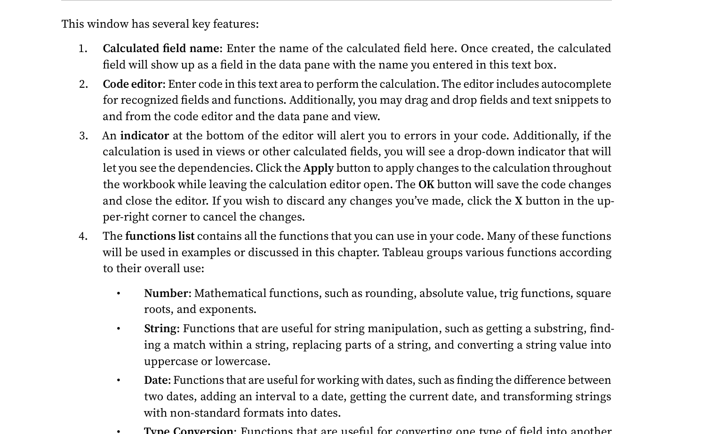
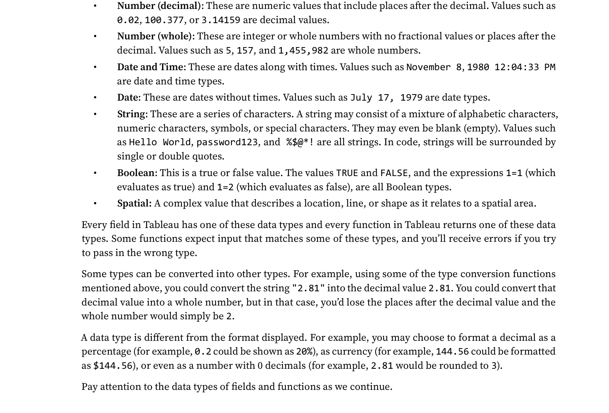
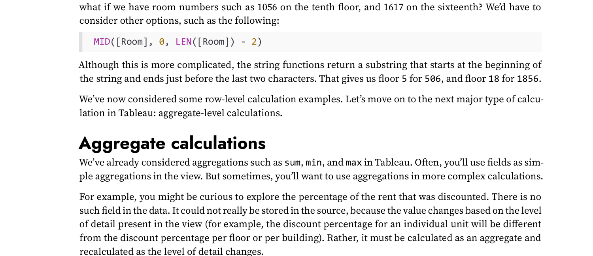

# Preprocessing Functions trong Tableau (theo Data Type)

> **Dataset sử dụng trong ví dụ:** Tableau Superstore — bộ dữ liệu mẫu có sẵn trong Tableau Desktop, tại menu **Help → Sample Workbooks → Superstore**. Dataset gồm ~10.000 dòng đơn hàng bán lẻ với các trường về sản phẩm, khách hàng, doanh thu và lợi nhuận.

---

## I. Giới thiệu — Dữ liệu thực tế không bao giờ "sạch" ngay từ đầu

Trong thực tế, hầu hết các bộ dữ liệu đều mang theo những vấn đề tiềm ẩn mà mắt thường khó nhận ra. Một file CSV xuất từ hệ thống ERP có thể chứa tên khách hàng bị viết không nhất quán (`"nguyen van a"` và `"NGUYEN VAN A"` là hai khách hàng khác nhau trong mắt Tableau), cột ngày tháng bị lưu dưới dạng văn bản thay vì kiểu Date thực sự, hay cột doanh thu bị nhận nhầm là String khiến Tableau từ chối tính tổng.

Thông thường, các lỗi này được xử lý trong Python với Pandas trước khi đưa vào Tableau. Tuy nhiên, Tableau cung cấp một công cụ mạnh mẽ ngay bên trong môi trường phân tích — **Calculated Field** — cho phép chúng ta biến đổi, chuẩn hóa và tạo cột mới mà không cần rời khỏi Tableau. Điều này đặc biệt hữu ích khi dữ liệu nguồn cập nhật thường xuyên và ta không muốn phải chạy lại pipeline xử lý mỗi lần.

> **📌 Khái niệm — Calculated Field (Trường tính toán)**
>
> **Calculated Field** là một cột dữ liệu mới được tạo ra bằng cách viết biểu thức (expression) trực tiếp trong Tableau. Calculated Field không thay đổi dữ liệu gốc trong nguồn — nó chỉ thực hiện phép tính tại thời điểm hiển thị, giống như một cột "ảo" được tính toán theo thời gian thực.
>
> **Cách tạo:** Trên thanh menu, chọn **Analysis** → **Create Calculated Field...** Cửa sổ công thức sẽ hiện ra, nơi bạn nhập biểu thức và Tableau sẽ gợi ý hàm tự động.



*Hình 1: Cửa sổ tạo Calculated Field — gồm 4 thành phần chính: tên field, code editor, chỉ báo lỗi, và danh sách hàm phân loại theo kiểu dữ liệu.*

Trong phần này, chúng ta sẽ khám phá các hàm preprocessing được tổ chức theo **kiểu dữ liệu (data type)** — vì mỗi kiểu có bộ hàm riêng phù hợp với đặc điểm của nó.

---

## II. Data Types trong Tableau

Khi kết nối với nguồn dữ liệu, Tableau tự động phân tích và gán **kiểu dữ liệu (data type)** cho từng cột dựa trên nội dung của nó. Mỗi data type được nhận diện thông qua một **icon đặc trưng** hiển thị bên trái tên field trong Data Pane. Việc hiểu đúng data type cực kỳ quan trọng vì nó quyết định hàm nào có thể áp dụng, loại aggregation nào được phép, và biểu đồ nào Tableau sẽ gợi ý khi bạn drag field vào canvas.

Tableau hỗ trợ 6 data type cơ bản, được tóm tắt trong bảng sau:

| Icon | Data Type | Mô tả | Ví dụ trong Superstore |
|:----:|:----------|:------|:----------------------|
| **Abc** | **String** | Văn bản — chuỗi ký tự bất kỳ | `Customer Name`, `Product Name`, `Region` |
| **#** | **Number** | Số — nguyên hoặc thập phân | `Sales`, `Profit`, `Quantity`, `Discount` |
| **📅** | **Date** | Ngày tháng — chỉ có ngày, không có giờ | `Order Date`, `Ship Date` |
| **📅🕐** | **Date & Time** | Ngày tháng kèm giờ phút giây | Dấu thời gian giao dịch hệ thống |
| **T\|F** | **Boolean** | Nhị phân — chỉ có True hoặc False | Kết quả so sánh, điều kiện lọc |
| **🌐** | **Geographic** | Địa lý — Tableau tự nhận diện để vẽ bản đồ | `Country`, `State`, `City`, `Postal Code` |



*Hình 2: Các Data Types trong Tableau — mỗi kiểu có đặc điểm riêng và quyết định hàm nào có thể áp dụng. Lưu ý sự khác biệt giữa Number (decimal) và Number (whole).*

> **⚠️ Lưu ý — Tableau có thể nhận sai data type**
>
> Tableau nhận diện data type dựa trên mẫu dữ liệu trong file, nhưng đôi khi mắc lỗi. Trường hợp phổ biến nhất là cột `Order Date` trong file CSV bị lưu với định dạng không chuẩn (`"15/1/2024"` thay vì `"2024-01-15"`) khiến Tableau nhận nhầm thành String — mọi hàm ngày tháng sẽ thất bại.
>
> **Cách kiểm tra nhanh:** Nhìn vào icon bên trái tên field trong Data Pane. Nếu thấy **Abc** cho một cột mà bạn biết là ngày tháng hoặc số, đó là dấu hiệu dữ liệu cần được chuyển đổi kiểu trước khi phân tích.

---

## III. Preprocessing Functions theo Data Type

Tableau cung cấp hàng chục hàm preprocessing, được phân loại theo data type mà chúng xử lý. Trong thực tế, phần lớn các vấn đề tiền xử lý dữ liệu đều rơi vào 4 nhóm: **String**, **Number**, **Date**, và **Type Conversion**. Chúng ta sẽ đi sâu vào từng nhóm với bối cảnh thực tế và ví dụ cụ thể từ dataset Superstore.

---

### A. String Functions — Xử lý văn bản

Khi làm việc với dữ liệu thực tế, các trường văn bản thường là nguồn gốc của nhiều lỗi tinh vi nhất. Một cột `Customer Name` xuất từ hệ thống CRM có thể chứa khoảng trắng thừa ở đầu và cuối (do nhập liệu), viết hoa viết thường không nhất quán, hoặc thậm chí có ký tự đặc biệt không mong muốn. Những lỗi này không gây ra thông báo lỗi — Tableau vẫn chạy bình thường — nhưng kết quả phân tích sẽ sai: cùng một khách hàng nhưng bị đếm thành nhiều người khác nhau, filter không hoạt động đúng, hay group by ra kết quả thiếu.

Tableau cung cấp một bộ hàm String phong phú để giải quyết các vấn đề này. Dưới đây là 8 hàm thực dụng nhất mà một nhà phân tích dữ liệu cần nắm:

- **`UPPER(string)` và `LOWER(string)`:** Chuyển đổi toàn bộ chuỗi sang chữ HOA hoặc chữ thường. Đây là thao tác chuẩn hóa đầu tiên khi cần so sánh hoặc nhóm dữ liệu văn bản — `"Furniture"` và `"furniture"` là hai giá trị khác nhau trong Tableau, nhưng sau khi áp dụng `LOWER()` chúng sẽ hợp nhất thành một nhóm duy nhất.

- **`TRIM(string)`:** Xóa khoảng trắng ở **đầu và cuối** chuỗi — không xóa khoảng trắng ở giữa. Đây là một trong những hàm quan trọng nhất vì khoảng trắng thừa hoàn toàn vô hình khi nhìn bằng mắt, nhưng khiến `"Hà Nội"` và `" Hà Nội"` trở thành hai chuỗi khác nhau và filter sẽ không khớp.

- **`LEFT(string, number)` và `RIGHT(string, number)`:** Trích xuất `n` ký tự từ bên trái hoặc bên phải của chuỗi. Ứng dụng phổ biến: trích xuất mã tỉnh/thành từ `"HN-001"` bằng `LEFT([City Code], 2)` để lấy `"HN"`, hay lấy phần mở rộng file từ tên file.

- **`MID(string, start, length)`:** Trích xuất một đoạn con từ giữa chuỗi, bắt đầu từ vị trí `start` (1-indexed) với độ dài `length` ký tự. Hàm này hữu ích khi mã định danh có cấu trúc cố định, ví dụ `"US-2024-00123"` — ta có thể dùng `MID([Order ID], 4, 4)` để lấy năm `"2024"`.

- **`REPLACE(string, old_substring, new_substring)`:** Tìm và thay thế tất cả các lần xuất hiện của `old_substring` bằng `new_substring`. Dùng nhiều để loại bỏ ký tự lạ: `REPLACE([Phone], "-", "")` để xóa dấu gạch trong số điện thoại `"090-123-4567"` → `"0901234567"`.

- **`CONTAINS(string, substring)`:** Kiểm tra xem chuỗi có chứa chuỗi con không, trả về `True` hoặc `False`. Thường dùng để tạo filter hoặc field phân loại: `CONTAINS([Product Name], "Chair")` trả về True cho tất cả sản phẩm có chữ "Chair" trong tên.

- **`LEN(string)`:** Đếm tổng số ký tự trong chuỗi. Hàm này thường dùng để kiểm tra dữ liệu: nếu mã sản phẩm phải có đúng 8 ký tự, `LEN([Product ID]) != 8` sẽ phát hiện các mã bị lỗi.

- **`SPLIT(string, delimiter, token_number)`:** Tách chuỗi thành các phần dựa trên ký tự phân cách và lấy phần thứ `token_number`. Ví dụ `SPLIT("Furniture/Bookcases", "/", 2)` trả về `"Bookcases"`. Rất hữu ích với dữ liệu kiểu `"Category/Sub-Category"`.

- **Toán tử nối chuỗi `+`:** Trong Tableau, khi làm việc với String, dấu cộng `+` được dùng để **ghép nối (concatenate)** của các chuỗi, không phải cộng số. Ví dụ: `[First Name] + " " + [Last Name]` tạo ra chuỗi đầy đủ `"Claire Gute"`. Lưu ý quan trọng: **phải thêm khoảng trắng thủ công** vào công thức (`+ " " +`), nếu viết `[First Name] + [Last Name]` kết quả sẽ là `"ClaireGute"` liền không có dấu cách.

- **`STARTSWITH(string, substring)`:** Kiểm tra xem chuỗi có **bắt đầu** bằng chuỗi con không, trả về `True/False`. `STARTSWITH([Order ID], "US")` trả về True cho tất cả đơn hàng có mã bắt đầu bằng "US". Đây là phiên bản nhanh hơn của `LEFT([str], LEN([sub])) = [sub]`.

- **`ENDSWITH(string, substring)`:** Kiểm tra xem chuỗi có **kết thúc** bằng chuỗi con không. `ENDSWITH([File Name], ".csv")` trả về True cho các file CSV. Kết hợp với `CONTAINS`, `STARTSWITH`, `ENDSWITH` tạo bộ công cụ kiểm tra chuỗi đầy đủ.

- **`FIND(string, substring, [start])`:** Tìm vị trí của chuỗi con trong chuỗi — trả về số thứ tự ký tự (1-indexed), hoặc **0 nếu không tìm thấy**. Tham số `start` tùy chọn cho phép bắt đầu tìm từ vị trí nhất định. Ví dụ: `FIND("CA-2024-01", "-")` = 3 (vị trí dấu gạch đầu tiên). Hữu ích để trích xuất động khi cấu trúc mã không cố định.

- **`LTRIM(string)` và `RTRIM(string)`:** Xóa khoảng trắng **chỉ bên trái** (`LTRIM`) hoặc **chỉ bên phải** (`RTRIM`) — chi tiết hơn `TRIM()` vốn xóa cả 2 phía. Dùng khi biết rõ khoảng trắng dư chỉ ở một phía cụ thể.

**Ví dụ tổng hợp — Chuẩn hóa tên khách hàng:**

Giả sử trường `Customer Name` trong Superstore có giá trị lộn xộn như `"  CLAIRE GUTE  "` (thừa khoảng trắng, toàn chữ hoa). Chúng ta tạo một Calculated Field mới tên `[Customer Name Cleaned]`:

```
// Xóa khoảng trắng dư + chuyển về chữ thường để chuẩn hóa so sánh
LOWER(TRIM([Customer Name]))

// Kết quả: "claire gute"
```

Hoặc nếu muốn kiểm tra nhanh tên nào còn khoảng trắng thừa (để lọc ra dữ liệu lỗi):

```
// True = có khoảng trắng thừa ở đầu hoặc cuối
LEN([Customer Name]) != LEN(TRIM([Customer Name]))

// Kết quả: True / False
```



*Hình 3: Ví dụ thực tế về String Functions — dùng `MID()` và `LEN()` để trích xuất thông tin từ mã phòng. Mã màu cú pháp giúp phân biệt tên hàm (xanh), tên field (cam), và hằng số (tím).*

> **💡 Tip — Tableau không có hàm PROPER()**
>
> Python có `str.title()` và Excel có `PROPER()` để viết hoa chữ cái đầu mỗi từ, nhưng Tableau không có hàm tương đương sẵn có.
>
> Workaround đơn giản cho tên một từ: `UPPER(LEFT([Name], 1)) + LOWER(MID([Name], 2, LEN([Name])))`
>
> Tuy nhiên với tên nhiều từ (như tên người), workaround này chỉ viết hoa được từ đầu tiên. Đối với trường hợp này, tốt hơn nên xử lý bằng Python trước khi import vào Tableau.

---

### B. Number Functions — Xử lý số

Dữ liệu số trong Tableau ít gặp lỗi về kiểu hơn String, nhưng vẫn cần xử lý trong nhiều tình huống: làm tròn để hiển thị gọn gàng, lấy trị tuyệt đối khi chỉ quan tâm độ lớn, hay xử lý giá trị NULL khiến mọi phép tính đều trả về NULL thay vì giá trị thực.

Trong dataset Superstore, trường `Profit` là ví dụ điển hình — nó có thể mang giá trị âm khi đơn hàng bị lỗ, và trường `Discount` thường là số thập phân (0.1, 0.2, ...) cần làm tròn khi hiển thị. Dưới đây là 5 hàm Number thực dụng nhất:

- **`ROUND(number, decimal_places)`:** Làm tròn đến số chữ số thập phân chỉ định. `ROUND([Sales], 2)` làm tròn doanh thu đến 2 chữ số thập phân. Khi `decimal_places = 0`, hàm làm tròn về số nguyên gần nhất. Khi `decimal_places` là số âm, hàm làm tròn về hàng chục, hàng trăm... ví dụ `ROUND(1234, -2)` = 1200.

- **`CEILING(number)` và `FLOOR(number)`:** Hai hàm làm tròn "lệch" — `CEILING()` luôn làm tròn **lên** đến số nguyên tiếp theo (ví dụ `CEILING(3.2)` = 4), còn `FLOOR()` luôn làm tròn **xuống** (ví dụ `FLOOR(3.8)` = 3). Khác với `ROUND()` tuân theo quy tắc "làm tròn vào số nguyên gần nhất", `CEILING` và `FLOOR` hoạt động theo hướng cố định — hữu ích trong các bài toán phân nhóm hay làm tròn giá vé, chi phí vận chuyển.

- **`ABS(number)`:** Trả về giá trị tuyệt đối — bỏ dấu âm. `ABS([Profit])` cho biết độ lớn của lãi/lỗ bất kể chiều hướng. Thường dùng trong các bài toán đo lường độ sai lệch: `ABS([Actual] - [Target])`.

- **`ZN(expression)`:** Viết tắt của **"Zero if Null"** — nếu biểu thức trả về NULL thì thay bằng 0, ngược lại giữ nguyên giá trị. Đây là một trong những hàm quan trọng nhất khi làm việc với dữ liệu có missing values, vì trong Tableau bất kỳ phép tính nào có NULL đều trả về NULL: `NULL + 100 = NULL`, `NULL * 5 = NULL`, `SUM(NULL, 100) = 100` nhưng `NULL / 100 = NULL`.

- **`POWER(number, exponent)`:** Tính lũy thừa. `POWER([Sales], 2)` = Sales bình phương. Ít dùng trong phân tích kinh doanh thông thường nhưng cần thiết khi tính các chỉ số thống kê hoặc chuẩn hóa dữ liệu.

- **`SIGN(number)`:** Trả về **-1** nếu số âm, **0** nếu bằng 0, **1** nếu dương. Đây là cách rất gọn để phân loại hướng thay đổi — thay vì viết `IF [Profit] > 0 THEN 1 ELSEIF [Profit] < 0 THEN -1 ELSE 0 END`, chỉ cần `SIGN([Profit])`. Thường dùng kết hợp với CASE để tạo label: `CASE SIGN([Profit]) WHEN 1 THEN "Lãi" WHEN -1 THEN "Lỗ" ELSE "Hòa vốn" END`.

- **`DIV(integer1, integer2)`:** Chia nguyên — trả về phần nguyên của phép chia, bỏ phần thập phân. `DIV(7, 2)` = 3 (không phải 3.5). Khác với phép chia `/` thông thường. Hữu ích khi tính số lô hàng nguyên: `DIV([Quantity], [Batch Size])`.

**Ví dụ tổng hợp — Phân loại đơn hàng theo lợi nhuận:**

Chúng ta tạo một Calculated Field `[Profit Category]` để phân nhóm đơn hàng dựa trên trường `Profit`:

```
// Phân loại đơn hàng: Lãi, Huề vốn, hoặc Lỗ
IF [Profit] > 0 THEN "Profitable"
ELSEIF [Profit] = 0 THEN "Break-even"
ELSE "Loss"
END

// Kết quả: "Profitable" / "Break-even" / "Loss" cho từng dòng
```

Và tính **tỷ suất lợi nhuận (profit margin)** một cách an toàn, tránh lỗi chia cho 0:

```
// ZN đảm bảo khi Sales = NULL thì kết quả = 0 thay vì NULL
ZN([Profit]) / ZN([Sales])

// Hoặc viết cẩn thận hơn để tránh lỗi chia cho 0:
IF ZN([Sales]) = 0 THEN 0
ELSE [Profit] / [Sales]
END
```

> **⚠️ Lưu ý — NULL trong Tableau ≠ 0**
>
> Đây là một trong những điểm gây nhầm lẫn phổ biến nhất. Trong Tableau, NULL không phải là 0 — nó là "không có dữ liệu". Mọi phép tính số học với NULL đều trả về NULL, không phải một số.
>
> Ví dụ thực tế: Nếu một khách hàng chưa có đơn hàng nào trong tháng, trường `Sales` của họ là NULL (không phải 0). `SUM(NULL, 50, 30)` = 80 — hàm SUM bỏ qua NULL. Nhưng `NULL / 100` = NULL — phép chia thất bại. Luôn dùng `ZN()` trước khi thực hiện phép chia để đảm bảo an toàn.

---

### C. Date Functions — Xử lý ngày tháng

Phân tích theo thời gian là một trong những yêu cầu phổ biến nhất trong Business Intelligence. Với dataset Superstore có hai trường date là `Order Date` và `Ship Date`, chúng ta cần khả năng: tách năm/quý/tháng để nhóm dữ liệu, tính khoảng cách giữa ngày đặt hàng và ngày giao hàng, hay lọc ra các đơn hàng trong 30 ngày gần nhất so với ngày hôm nay. Tất cả những điều này đều cần Date Functions.

Trước khi bắt đầu, cần hiểu khái niệm quan trọng nhất trong Date Functions — tham số **`date_part`**. Đây là một chuỗi chỉ định **đơn vị thời gian** mà hàm sẽ làm việc với. Bảng dưới liệt kê các giá trị `date_part` phổ biến nhất:

| Giá trị `date_part` | Ý nghĩa | Kết quả trả về (ví dụ với 15/03/2024) |
|:--------------------|:--------|:--------------------------------------|
| `'year'` | Năm | 2024 |
| `'quarter'` | Quý trong năm | 1 (Q1: tháng 1-3) |
| `'month'` | Tháng trong năm | 3 |
| `'day'` | Ngày trong tháng | 15 |
| `'weekday'` | Thứ trong tuần | 6 (6 = Thứ Sáu, theo chuẩn ISO) |
| `'hour'` | Giờ (chỉ dùng với Date & Time) | 0–23 |

Các hàm Date thực dụng nhất trong phân tích dữ liệu bán hàng:

- **`YEAR(date)`, `MONTH(date)`, `DAY(date)`:** Ba hàm đơn giản nhất để trích xuất năm, tháng, ngày từ một trường Date. `YEAR([Order Date])` trả về số nguyên như 2021, 2022... Đây là cách nhanh nhất để tạo các trường phụ trợ phục vụ nhóm dữ liệu theo thời gian.

- **`DATEPART(date_part, date)`:** Tổng quát hơn `YEAR/MONTH/DAY` — có thể lấy bất kỳ đơn vị thời gian nào bằng cách truyền `date_part` làm tham số. `DATEPART('quarter', [Order Date])` trả về 1, 2, 3, hoặc 4 tương ứng với Q1-Q4. Kết quả là **số nguyên**, phù hợp cho tính toán.

- **`DATENAME(date_part, date)`:** Tương tự `DATEPART` nhưng trả về **tên dạng chuỗi** thay vì số. `DATENAME('month', [Order Date])` trả về `"January"`, `"February"`... Hữu ích khi muốn hiển thị nhãn trên biểu đồ thân thiện với người đọc hơn là số tháng.

- **`DATEDIFF(date_part, start_date, end_date)`:** Tính **khoảng cách** giữa hai ngày theo đơn vị `date_part`. `DATEDIFF('day', [Order Date], [Ship Date])` cho biết mất bao nhiêu ngày để giao hàng. `DATEDIFF('month', [Order Date], TODAY())` cho biết đơn hàng cách đây bao nhiêu tháng so với hôm nay.

- **`DATEADD(date_part, interval, date)`:** Cộng (hoặc trừ nếu `interval` âm) một khoảng thời gian vào một ngày. `DATEADD('month', 3, [Order Date])` trả về ngày 3 tháng sau ngày đặt hàng — hữu ích để tính ngày hết hạn bảo hành, ngày tái đặt hàng, hay ngày dự kiến thanh toán.

- **`TODAY()`:** Trả về ngày hôm nay (không có giờ). Thường kết hợp với `DATEDIFF` để tạo filter động: đơn hàng trong 30 ngày gần nhất, khách hàng chưa mua trong 90 ngày...

- **`DATETRUNC(date_part, date)`:** "Cắt" ngày về **đầu kỳ** tương ứng với `date_part`. Đây là hàm rất mạnh cho nhóm dữ liệu theo kỳ: `DATETRUNC('month', #2024-03-15#)` = **1/3/2024** (ngày đầu tiên của tháng 3); `DATETRUNC('quarter', #2024-03-15#)` = **1/1/2024** (ngày đầu tiên của Q1). Cực kỳ hữu ích khi cần so sánh các kỳ với nhau — thay vì group by tháng và gặp vấn đề sắp xếp, hãy dùng DATETRUNC để tạo một trường Date chuẩn.

- **`NOW()`:** Trả về **ngày và giờ hiện tại** (Date & Time) — khác với `TODAY()` chỉ trả về ngày. `NOW()` hữu ích khi cần tính thời gian tính đến giây: `DATEDIFF('minute', [Order Time], NOW())` để biết đơn hàng đã chờ bao nhiêu phút. Lưu ý: `NOW()` tính theo múi giờ của máy chủ Tableau, không phải browser người dùng.

- **`QUARTER(date)` và `WEEK(date)`:** Shorthand nhanh — `QUARTER([Order Date])` = `DATEPART('quarter', [Order Date])` trả về 1–4; `WEEK([Order Date])` trả về số tuần trong năm (1–52/53). Dùng khi chỉ cần số nguyên để tính toán.

- **`MAKEDATE(year, month, day)`:** Tạo một giá trị Date từ 3 số nguyên riêng lẻ. `MAKEDATE(2024, 3, 15)` tạo ngày 15/3/2024. Hữu ích khi dữ liệu lưu riêng năm, tháng, ngày trong 3 cột Number và bạn cần ghép lại thành một Date field để dùng các hàm Date.

- **`DATEPARSE(format, string)`:** Chuyển đổi một **chuỗi** có định dạng đặc biệt thành kiểu Date mà hàm `DATE()` thông thường không nhận ra. Đây là hàm quan trọng khi dữ liệu ngày tháng đến từ nhiều nguồn khác nhau với định dạng khác nhau. Ví dụ chuỗi `"September,4,12"` với định dạng `"MMMM,d,yy"` sẽ được giải mã thành ngày 4/9/2012:

  ```
  DATEPARSE("MMMM,d,yy", "September,4,12")
  // Kết quả: 9/4/2012 (ngày tháng năm theo ISO)
  ```

  Các định dạng phổ biến trong `DATEPARSE`: `yyyy` = năm 4 chữ số, `MM` = tháng 2 chữ số, `dd` = ngày 2 chữ số, `MMMM` = tên tháng đầy đủ ("January"), `MMM` = tên tháng viết tắt ("Jan"). Điều kiện bắt buộc: chuỗi format phải **khớp chính xác** với cấu trúc của chuỗi ngày, bao gồm cả dấu phân cách.

**Ví dụ tổng hợp — Phân tích thời gian giao hàng:**

```
// Tính số ngày giao hàng (từ Order Date đến Ship Date)
DATEDIFF('day', [Order Date], [Ship Date])
// Kết quả: 2, 3, 5... (số nguyên)

// Phân loại tốc độ giao hàng
IF DATEDIFF('day', [Order Date], [Ship Date]) <= 2 THEN "Fast (≤2 days)"
ELSEIF DATEDIFF('day', [Order Date], [Ship Date]) <= 5 THEN "Normal (3-5 days)"
ELSE "Slow (>5 days)"
END

// Lọc đơn hàng trong 365 ngày gần nhất so với hôm nay
DATEDIFF('day', [Order Date], TODAY()) <= 365
// Kết quả: True / False — dùng làm filter condition
```

> **💡 Tip — DATEPART vs DATENAME: khi nào dùng cái nào?**
>
> Chọn đúng hàm sẽ giúp biểu đồ hiển thị chính xác hơn:
> - Dùng **`DATEPART('month', ...)`** → kết quả là số `1, 2, ..., 12` → khi cần **tính toán** (so sánh, cộng trừ)
> - Dùng **`DATENAME('month', ...)`** → kết quả là `"January", "February", ...` → khi cần **hiển thị nhãn** trên trục X của biểu đồ
>
> Lưu ý: kết quả của `DATENAME` sẽ sắp xếp theo bảng chữ cái (April, August, December...) thay vì theo thứ tự tháng. Để sắp xếp đúng thứ tự tháng, hãy dùng thêm `DATEPART` làm trường sắp xếp phụ trợ (Sort Field).

---

### E. Ad-hoc Calculations và xử lý giá trị NULL

Ngoài việc tạo Calculated Field đầy đủ qua menu **Analysis → Create Calculated Field...**, Tableau còn hỗ trợ một cách tạo công thức nhanh hơn gọi là **Ad-hoc Calculation**. Phương pháp này cho phép nhập công thức **trực tiếp trên Columns shelf, Rows shelf, hoặc thẻ Marks** mà không cần đặt tên hay lưu lại. Đây thường là cách nhanh nhất khi cần thử nghiệm một công thức đơn giản như `Profit Ratio` — tỷ suất lợi nhuận.

**Cách tạo Ad-hoc Calculation:**
1. Kéo field `Profit` vào Columns shelf. Tableau hiển thị `SUM([Profit])`.
2. Nhấp đúp vào pill `SUM([Profit])` trỪn Columns shelf — một ô nhập công thức nhỏ xuất hiện.
3. Sửa thành `SUM([Profit])/SUM([Sales])` và nhấn **Enter**. Tableau tính và hiển thị kết quả ngay lập tức mà không cần tạo field mới.
4. Nếu muốn lưu lại công thức này để dùng lại sau: kéo pill từ shelf vào **Data Pane**, Tableau sẽ hiển thị hộp thoại yêu cầu đặt tên cho Calculated Field.

Tableau có hệ thống **mã màu cú pháp** trong Formula Editor giúp xác định từng thành phần của công thức:

| Màu/kiểu chữ | Ý nghĩa |
|:--------------|:---------|
| **Chữ đỏ** (gạch chân) | Lỗi cú pháp — di chuột lên để xem gợi ý sửa |
| `// chữ màu xám` | Comment — không ảnh hưởng tính toán, dùng để ghi chú |
| **[chữ màu cam]** | Tên field — cần bao bằng dấu `[]` |
| **chữ màu xanh** | Tên hàm (function) |
| **[chữ màu tím]** | Parameters |
| **chữ in đậm** | Phép tính được aggregate (tính cùng Tableau) |
| chữ không in đậm | Phép tính ở mức cơ sở dữ liệu (row-level) |

**Xử lý giá trị NULL với `ZN()`:**

Khi kết hợp hoặc trộn lẫn nhiều nguồn dữ liệu, một số ô có thể không có giá trị (NULL). Trong Tableau, `NULL + bất kì số nào = NULL` — nghĩa là một giá trị NULL duy nhất trong chuỗi tính toán sẽ làm cho toàn bộ kết quả là NULL.

**Hàm `ZN(expression)`** (Zero-if-Null) giải quyết vấn đề này bằng cách thay thế NULL bằng 0, giúp các phép tính điến được:

```
// Không an toàn: nếu một đơn hàng không có giá trị Discount, kết quả sẽ là NULL
[Sales] * [Discount]

// An toàn: ZN thay NULL bằng 0 trước, đảm bảo phép tính luôn ra số
ZN([Sales]) * ZN([Discount])
```

Lưu ý: `ZN` chỉ dùng đối với số (Number) — thay NULL số bằng 0 thường hợp lý (không có Discount có nghĩa Discount = 0%), nhưng cần cân nhắc kỹ trong ngữ cảnh cụ thể.

---

### D. Type Conversion Functions — Chuyển đổi kiểu dữ liệu

Một trong những vấn đề phổ biến nhất khi import dữ liệu vào Tableau là **kiểu dữ liệu bị nhận sai**. Nguyên nhân thường gặp là: file CSV có cột số nhưng chứa ký tự không phải số (dấu phẩy ngăn cách hàng nghìn như `"1,234.56"`, đơn vị tiền tệ như `"$500"`, hay khoảng trắng), cột ngày tháng có định dạng địa phương không chuẩn (`"15/3/24"` thay vì `"2024-03-15"`), hoặc đơn giản là Tableau đọc toàn bộ cột đầu tiên là String vì có một vài ô chứa chữ.

Khi dữ liệu bị nhận sai kiểu, hậu quả rất rõ ràng: không thể tính `SUM([Revenue])` nếu Revenue là String, không thể dùng `YEAR([Order Date])` nếu Order Date là String, và biểu đồ Line Chart sẽ không hoạt động đúng với trục thời gian. Type Conversion Functions cho phép chúng ta ép kiểu (cast) dữ liệu sang đúng loại cần thiết:

- **`INT(expression)`:** Chuyển đổi sang số nguyên, cắt bỏ phần thập phân (không làm tròn — `INT(3.9)` = 3, không phải 4). Dùng khi cột số bị nhận là String và bạn chắc chắn dữ liệu là số nguyên, ví dụ cột `Quantity` bị nhận là Abc.

- **`FLOAT(expression)`:** Chuyển đổi sang số thực (có phần thập phân). Đây là hàm phổ biến hơn `INT` vì giữ được độ chính xác. `FLOAT("1234.56")` trả về số `1234.56` có thể dùng cho `SUM`, `AVG`.

- **`STR(expression)`:** Chuyển đổi **sang String**. Hữu ích khi cần ghép Number vào chuỗi văn bản: `"Order #" + STR([Order ID])` tạo ra chuỗi như `"Order #12345"`. Không thể ghép String trực tiếp với Number trong Tableau mà không chuyển đổi trước.

- **`DATE(expression)`:** Chuyển đổi một String hoặc Number sang kiểu Date. `DATE("2024-01-15")` trả về ngày 15/1/2024 với đầy đủ khả năng sử dụng các Date Functions. Đây là hàm quan trọng nhất trong nhóm này khi làm việc với dữ liệu thực tế.

- **`DATETIME(expression)`:** Tương tự `DATE()` nhưng tạo ra giá trị Date & Time, bao gồm cả giờ phút giây. Dùng khi cần độ chính xác đến giờ/phút trong phân tích.

**Ví dụ tổng hợp — Sửa cột dữ liệu bị nhận sai kiểu:**

```
// Trường hợp 1: Cột "Revenue_str" = "1234.56" (bị nhận là String)
// → Chuyển thành Number để có thể SUM, AVG
FLOAT([Revenue_str])
// Kết quả: 1234.56 — bây giờ có thể SUM([Revenue_str_converted])

// Trường hợp 2: Cột "Order_Date_str" = "2024-01-15" (String)
// → Chuyển thành Date để dùng YEAR(), DATEDIFF()...
DATE([Order_Date_str])
// Kết quả: 15/01/2024 (Date) — bây giờ có thể YEAR([Order_Date_converted])

// Trường hợp 3: Tạo label kết hợp số và chữ
"Đơn hàng #" + STR([Order ID]) + " — " + STR([Customer Name])
// Kết quả: "Đơn hàng #12345 — Claire Gute"
```

> **⚠️ Lưu ý — Nhận biết lỗi kiểu dữ liệu ngay từ đầu**
>
> Có 3 dấu hiệu rõ ràng cho thấy một field đang bị sai kiểu:
> 1. Field có icon **Abc** trong Data Pane nhưng bạn biết nó là số hoặc ngày
> 2. Tableau báo lỗi **"Cannot mix aggregate and non-aggregate arguments"** khi bạn cố tính SUM
> 3. Tableau không gợi ý **Line Chart** khi bạn drag một Date field vào Columns (vì nó không nhận ra đó là Date)
>
> Bước xử lý chuẩn: tạo Calculated Field mới dùng `FLOAT()`, `DATE()`, hay `INT()` để chuyển đổi, đặt tên rõ ràng (ví dụ `[Sales (Numeric)]`), rồi sử dụng field mới đó thay cho field gốc trong tất cả các visualization.

---

### F. Logical Functions — Phân loại và điều kiện hóa dữ liệu

Nếu String Functions giúp làm sạch dữ liệu và Date Functions giúp phân tích thời gian, thì **Logical Functions** là trái tim của mọi phân tích dữ liệu có chiều sâu — chúng cho phép Tableau đưa ra **quyết định** dựa trên điều kiện, phân loại dữ liệu thành nhóm, và xử lý các trường hợp đặc biệt. Bất kỳ câu hỏi dạng "Nếu... thì..." đều cần Logical Functions.

---

#### F.1 — IF / ELSEIF / ELSE / END — Điều kiện nhiều nhánh

Cú pháp IF là cách phổ biến nhất để phân loại dữ liệu trong Tableau:

```
IF <test1> THEN <value1>
ELSEIF <test2> THEN <value2>
...
ELSE <default_value>
END
```

- Tableau kiểm tra **lần lượt** từng điều kiện, trả về giá trị tương ứng với điều kiện đầu tiên là `True`
- `ELSEIF` và `ELSE` là tùy chọn — có thể viết IF...THEN...END đơn giản nếu chỉ có một điều kiện
- Phần `ELSE` là giá trị mặc định khi không có điều kiện nào khớp — nếu bỏ qua và không có điều kiện nào khớp, kết quả là `NULL`

**Ví dụ thực tế — Phân loại lợi nhuận:**

```
// Tạo Calculated Field [Profit Status]
IF [Profit] > 0 THEN "Profitable"
ELSEIF [Profit] = 0 THEN "Break-even"
ELSE "Loss"
END

// Kết quả: "Profitable" / "Break-even" / "Loss" cho từng đơn hàng
```

**Ví dụ nâng cao — Phân loại theo nhiều trường:**

```
// Phân loại khách hàng VIP dựa trên cả Sales và Profit
IF SUM([Sales]) > 10000 AND SUM([Profit]) > 1000
THEN "VIP"
ELSEIF SUM([Sales]) > 5000
THEN "Regular"
ELSE "New"
END

// Lưu ý: Khi dùng IF kết hợp aggregate (SUM), cả công thức phải ở cấp aggregate
```

> **📌 Khái niệm — IIF (Inline IF)**
>
> `IIF(<test>, <then>, <else>)` là phiên bản rút gọn của IF cho trường hợp chỉ có 2 nhánh. `IIF([Profit] > 0, "Lãi", "Lỗ")` tương đương với `IF [Profit] > 0 THEN "Lãi" ELSE "Lỗ" END`. Dùng khi công thức đơn giản — nhưng khi cần nhiều điều kiện, IF/ELSEIF dễ đọc hơn nhiều IIF lồng nhau.

---

#### F.2 — CASE / WHEN / THEN — Phân loại theo giá trị cụ thể

CASE là lựa chọn tốt hơn IF khi bạn cần so sánh **một field với nhiều giá trị cụ thể**:

```
CASE <expression>
WHEN <value1> THEN <result1>
WHEN <value2> THEN <result2>
...
[ELSE <default>]
END
```

**Ví dụ thực tế — Dịch tên vùng sang tiếng Việt:**

```
CASE [Region]
WHEN "East" THEN "Miền Đông"
WHEN "West" THEN "Miền Tây"
WHEN "North" THEN "Miền Bắc"
WHEN "South" THEN "Miền Nam"
ELSE "Không xác định"
END
```

**Ví dụ thực tế — Rút gọn Order Priority:**

```
CASE [Order Priority]
WHEN "Critical" THEN "🔴 Critical"
WHEN "High" THEN "🟡 High"
WHEN "Medium" THEN "🟢 Medium"
WHEN "Low" THEN "⚪ Low"
END
```

> **💡 Tip — IF vs CASE: khi nào dùng cái nào?**
>
> | CASE | IF |
> |:-----|:---|
> | So sánh **một field** với nhiều **giá trị rời rạc** | Kiểm tra **nhiều điều kiện phức tạp** khác nhau |
> | `[Region] = "East"`, `[Region] = "West"`... | `[Sales] > 10000 AND [Profit] > 0`... |
> | Cú pháp gọn hơn, dễ đọc hơn | Linh hoạt hơn — dùng được `>`, `<`, `AND`, `OR` |

---

#### F.3 — Toán tử logic: AND, OR, NOT

Các toán tử này kết hợp nhiều điều kiện vào một biểu thức:

- **`AND`:** Cả hai điều kiện đều phải `True`. `[Sales] > 1000 AND [Profit] > 0` — chỉ đơn hàng lãi VÀ có doanh thu cao. Lưu ý: AND dùng **short-circuit evaluation** — nếu điều kiện đầu tiên là `False`, điều kiện thứ hai không cần kiểm tra.

- **`OR`:** Chỉ cần một trong hai điều kiện là `True`. `[Region] = "East" OR [Region] = "West"` — đơn hàng ở Đông HOẶC Tây.

- **`NOT`:** Đảo ngược kết quả boolean. `NOT ISNULL([Customer ID])` — chỉ giữ lại các dòng có Customer ID.

```
// Ví dụ kết hợp: đơn hàng cần chú ý
// (Lỗ lớn HOẶC chiết khấu cao) VÀ không phải khách VIP
(SUM([Profit]) < -500 OR SUM([Discount]) > 0.3)
AND NOT ([Customer Segment] = "VIP")
```

---

#### F.4 — Xử lý NULL: ISNULL, IFNULL và ZN

Ba hàm xử lý NULL trong Tableau, mỗi hàm phục vụ mục đích khác nhau:

| Hàm | Cú pháp | Trả về | Dùng khi |
|:----|:--------|:-------|:---------|
| **`ISNULL`** | `ISNULL(expr)` | `True/False` | Cần **kiểm tra** xem field có NULL không |
| **`IFNULL`** | `IFNULL(expr1, expr2)` | Giá trị expr1 hoặc expr2 | Cần **thay thế NULL bằng giá trị bất kỳ** (không chỉ 0) |
| **`ZN`** | `ZN(expr)` | Giá trị hoặc **0** | Cần **thay NULL bằng 0** để phép tính số không thất bại |

```
// ISNULL — Phát hiện dữ liệu thiếu
ISNULL([Customer ID])
// Kết quả: True cho các dòng chưa có Customer ID → dùng làm filter

// IFNULL — Thay NULL bằng giá trị mặc định có nghĩa
IFNULL([Assigned Region], "Chưa phân vùng")
// Kết quả: Chuỗi thực hoặc "Chưa phân vùng" — không bao giờ NULL

// ZN — Đảm bảo an toàn cho phép tính số
ZN([Discount]) * ZN([Sales])
// Kết quả: Nếu Discount hoặc Sales là NULL → kết quả là 0, không phải NULL
```

> **⚠️ Lưu ý — IFNULL vs ZN vs ISNULL**
>
> - `ISNULL` chỉ **phát hiện** (trả Boolean), không thay thế
> - `IFNULL` thay NULL bằng **bất kỳ giá trị nào** (String, Number, Date...)
> - `ZN` chỉ thay bằng **0** — ngắn gọn nhưng chỉ dùng cho Number
> - Với String: dùng `IFNULL([Field], "N/A")` thay vì ZN
> - Với Number: có thể dùng cả `IFNULL([Field], 0)` hoặc `ZN([Field])`

---

#### F.5 — IN — So sánh với tập giá trị

`IN` kiểm tra xem một giá trị có nằm trong một danh sách hay không — ngắn gọn hơn nhiều `OR` liên tiếp:

```
// Thay vì:
[Region] = "East" OR [Region] = "West" OR [Region] = "Central"

// Dùng IN:
[Region] IN ("East", "West", "Central")
// Kết quả: True nếu Region bằng bất kỳ giá trị nào trong danh sách
```

`IN` cũng dùng được với Sets trong Tableau: `[Customer] IN [Top 10 Customers Set]`.

---

## IV. Bảng tổng hợp — Quick Reference

Bảng dưới đây tóm tắt toàn bộ các hàm đã học, sắp xếp theo vấn đề thực tế mà bạn có thể gặp. Đây là tài liệu tham khảo nhanh khi gặp phải dữ liệu lỗi trong dự án thực tế:

| Data Type | Vấn đề thực tế | Hàm xử lý | Ví dụ nhanh |
|:----------|:---------------|:-----------|:------------|
| **String** | Khoảng trắng thừa đầu/cuối | `TRIM()`, `LTRIM()`, `RTRIM()` | `TRIM([Name])` |
| **String** | Hoa/thường không nhất quán | `UPPER()`, `LOWER()` | `LOWER([Region])` |
| **String** | Trích xuất một phần | `LEFT()`, `RIGHT()`, `MID()` | `LEFT([Code], 3)` |
| **String** | Thay thế ký tự lạ | `REPLACE()` | `REPLACE([Phone], "-", "")` |
| **String** | Kiểm tra chứa chuỗi con | `CONTAINS()`, `STARTSWITH()`, `ENDSWITH()` | `STARTSWITH([ID], "US")` |
| **String** | Tìm vị trí chuỗi con | `FIND()` | `FIND([Code], "-")` |
| **Number** | Làm tròn khi hiển thị | `ROUND()` | `ROUND([Sales], 2)` |
| **Number** | Giá trị NULL gây lỗi | `ZN()` | `ZN([Profit])` |
| **Number** | Chỉ quan tâm độ lớn | `ABS()` | `ABS([Profit])` |
| **Number** | Xác định hướng âm/dương | `SIGN()` | `SIGN([Profit])` → -1/0/1 |
| **Date** | Nhóm theo năm/quý/tháng | `YEAR()`, `QUARTER()`, `DATEPART()` | `QUARTER([Date])` |
| **Date** | Cắt về đầu kỳ | `DATETRUNC()` | `DATETRUNC('month', [Date])` |
| **Date** | Label thân thiện | `DATENAME()` | `DATENAME('month', [Date])` |
| **Date** | Khoảng cách giữa 2 ngày | `DATEDIFF()` | `DATEDIFF('day', [Start], [End])` |
| **Date** | Ngày giờ hiện tại | `NOW()`, `TODAY()` | `NOW()` (có giờ), `TODAY()` (chỉ ngày) |
| **Kiểu sai** | String → Number | `FLOAT()`, `INT()` | `FLOAT([Sales_str])` |
| **Kiểu sai** | String → Date | `DATE()`, `DATEPARSE()` | `DATEPARSE("MMMM,d,yy", [Date_str])` |
| **Kiểu sai** | Number → String | `STR()` | `"ID: " + STR([ID])` |
| **Logic** | Phân loại nhiều nhánh | `IF/ELSEIF/ELSE/END` | `IF [Profit]>0 THEN "Lãi" ELSE "Lỗ" END` |
| **Logic** | Phân loại theo giá trị | `CASE/WHEN/THEN/END` | `CASE [Region] WHEN "East" THEN ...` |
| **Logic** | Kiểm tra NULL | `ISNULL()` | `ISNULL([Customer ID])` |
| **Logic** | Thay NULL bằng default | `IFNULL()`, `ZN()` | `IFNULL([Region], "N/A")` |

---

*Phần tiếp theo: **Basic Charts** — Tạo 4 loại biểu đồ cơ bản trong Tableau*
